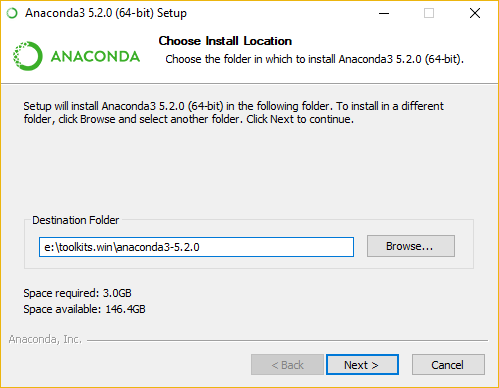
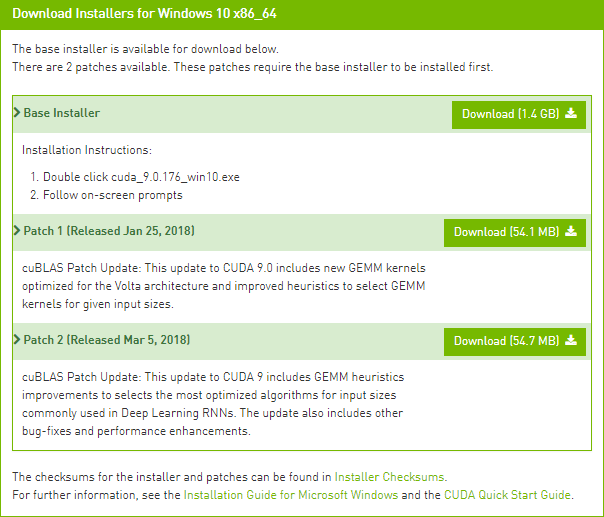
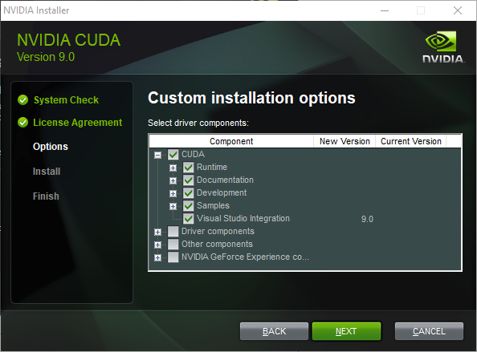
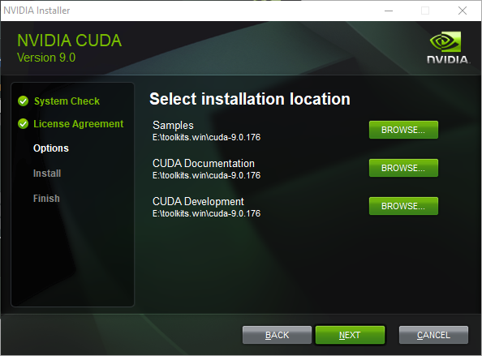
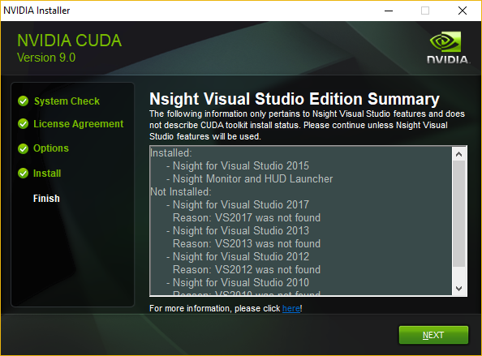
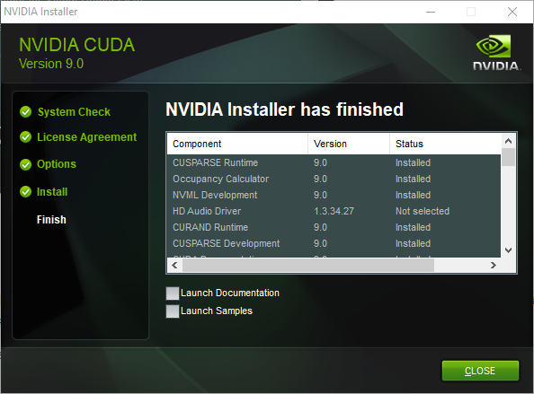
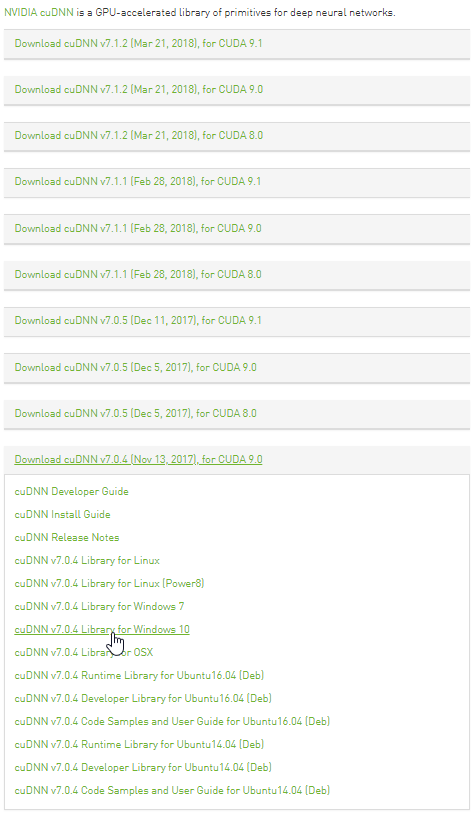

GPU-accelerated Deep Learning on Windows 10 native (Keras/Tensorflow/CNTK/MXNet and PyTorch)
===============================================================================

**>> LAST UPDATED JUNE, 2018 <<**

**This latest update:**
- **supports 5 frameworks (Keras/Tensorflow/CNTK/MXNet and PyTorch),**
- **supports 3 GPU-accelerated Keras backends (CNTK, Tensorflow, or MXNet),**
- **doesn't require installing MinGW separately,**
- **uses more recent versions of many python libraries.**

There are certainly a lot of guides to assist you build great deep learning (DL) setups on Linux or Mac OS (including with Tensorflow which, unfortunately, as of this posting, cannot be easily installed on Windows), but few care about building an efficient Windows 10-**native** setup. Most focus on running an Ubuntu VM hosted on Windows or using Docker, unnecessary - and ultimately sub-optimal - steps.

We also found enough misguiding/deprecated information out there to make it worthwhile putting together a step-by-step guide for the latest stable versions of Keras, Tensorflow, CNTK, MXNet, and PyTorch. Used either together (e.g., Keras with Tensorflow backend), or independently -- PyTorch cannot be used as a Keras backend, TensorFlow can be used on its own -- they make for some of the most powerful deep learning python libraries to work natively on Windows.

If you **must** run your DL setup on Windows 10, then the information contained here will hopefully be useful to you.

Older installation instructions from [July 2017](README_July2017.md), [May 2017](README_May2017.md) and [January 2017](README_Jan2017.md) are still available. They allow you to use Theano as a Keras backend.

# TOC

- [Dependencies](#dependencies)
- [Hardware](#hardware)
- [Installation steps](#installation-steps)
  * [Windows toolkits](#toolkits)
    + [Visual Studio 2015 Community Edition Update 3 w. Windows Kit 10.0.10240.0](#visual-studio-2015-community-edition-update-3-w-windows-kit-100102400)
    + [Anaconda 5.2.0 (64-bit) (Python 3.6 TF support / Python 2.7 no TF support))](#anaconda-520-64-bit-python-36-tf-support-python-27-no-tf-support)
      - [Create a `dlwin36` conda environment](#create-a-dlwin36-conda-environment)
      - [Optional but highly-recommended image processing libraries](#optional-but-highly-recommended-image-processing-libraries)
    + [CUDA 9.0.176 (64-bit)](#cuda-90176-64-bit)
    + [cuDNN v7.0.4 (Nov 13, 2017) for CUDA 9.0](#cudnn-v704-nov-13-2017-for-cuda-90)
  * [Deep learning python libraries](#deep-learning-python-libraries)
    + [Installing `keras` 2.1.6](#installing-keras-216)
    + [Installing `tensorflow-gpu` 1.8.0 (solo, or as a Keras backend)](#installing-tensorflow-gpu-180-solo-or-as-a-keras-backend)
    + [Installing `cntk-gpu` 2.5.1 (solo, or as a Keras backend)](#installing-cntk-gpu-251-solo-or-as-a-keras-backend)
    + [Installing `mxnet-cu90` 1.2.0 (solo, or as a Keras backend)](#installing-mxnet-cu90-120-solo-or-as-a-keras-backend)
    + [Installing `pytorch` 0.4.0](#installing-pytorch-040)
  * [Quick checks](#quick-checks)
    + [Checking the list of Python libraries installed](#checking-the-list-of-python-libraries-installed)
    + [Checking our PATH sysenv var](#checking-our-path-sysenv-var)
    + [Quick-checking each main Python library install](#quick-checking-each-main-python-library-install)
  * [GPU tests](#gpu-tests)
    + [Validating our GPU install with Keras](#validating-our-gpu-install-with-keras)
    + [Keras with Tensorflow backend (GPU disabled)](#keras-with-tensorflow-backend-gpu-disabled)
    + [Keras with Tensorflow backend (using GPU)](#keras-with-tensorflow-backend-using-gpu)
    + [Keras with CNTK backend (using GPU)](#keras-with-cntk-backend-using-gpu)
    + [Keras with MXNet backend (using GPU)](#keras-with-mxnet-backend-using-gpu)
    + [Validating our GPU install with PyTorch](#validating-our-gpu-install-with-pytorch)
- [Suggested viewing and reading](#suggested-viewing-and-reading)
- [About the Author](#about-the-author)

<small><i><a href='http://ecotrust-canada.github.io/markdown-toc/'>Table of contents generated with markdown-toc</a></i></small>

# Dependencies
Here's a summary list of the tools and libraries we use for deep learning on Windows 10 (Version 1709 OS Build 16299.371):

1. Visual Studio 2015 Community Edition Update 3 w. Windows Kit 10.0.10240.0
   - Used for its C/C++ compiler (not its IDE) and SDK. This specific version has been selected due to [Windows Compiler Support in CUDA](http://docs.nvidia.com/cuda/cuda-installation-guide-microsoft-windows/index.html#system-requirements).
2. Anaconda (64-bit) w. Python 3.6 (Anaconda3-5.2.0) [for Tensorflow support] or Python 2.7 (Anaconda2-5.2.0) [no Tensorflow support] with MKL 2018.0.3
   - A Python distro that gives us NumPy, SciPy, and other scientific libraries
   - MKL is used for its CPU-optimized implementation of many linear algebra operations
3. CUDA 9.0.176 (64-bit)
   - Used for its GPU math libraries, card driver, and CUDA compiler
4. cuDNN v7.0.4 (Nov 13, 2017) for CUDA 9.0.176
   - Used to run vastly faster convolution neural networks
5. Keras 2.1.6 with three different backends: Tensorflow-gpu 1.8.0, CNTK-gpu 2.5.1, and MXNet-cuda90 1.2.0
   - Keras is used for deep learning on top of Tensorflow or CNTK
   - Tensorflow and CNTK are backends used to evaluate mathematical expressions on multi-dimensional arrays
   - Theano is a legacy backend no longer in active development
6. PyTorch v0.4.0

# Hardware

1. Dell Precision T7900, 64GB RAM
   - Intel Xeon E5-2630 v4 @ 2.20 GHz (1 processor, 10 cores total, 20 logical processors)
2. NVIDIA GeForce Titan X, 12GB RAM
   - Driver version: 390.77 / Win 10 64
2. NVIDIA GeForce GTX 1080 Ti, 11GB RAM
   - Driver version: 390.77 / Win 10 64   

# Installation steps

We like to keep our toolkits and libraries in a single root folder boringly called `e:\toolkits.win`, so whenever you see a Windows path that starts with `e:\toolkits.win` below, make sure to replace it with whatever you decide your own toolkit drive and folder ought to be.

## Toolkits

### Visual Studio 2015 Community Edition Update 3 w. Windows Kit 10.0.10240.0

Download [Visual Studio Community 2015 with Update 3 (x86)](https://www.visualstudio.com/vs/older-downloads). It is used by the CUDA toolkit.
> Note that for downloading, a free [Visual Studio Dev Essentials](https://www.visualstudio.com/dev-essentials/) license or a full Visual Studio Subscription is required.

Run the downloaded executable to install Visual Studio, using whatever additional config settings work best for you:


1. Add `C:\Program Files (x86)\Microsoft Visual Studio 14.0\VC\bin` to your `PATH`, based on where you installed VS 2015.
2. Define sysenv variable `INCLUDE` with the value `C:\Program Files (x86)\Windows Kits\10\Include\10.0.10240.0\ucrt`
3. Define sysenv variable `LIB` with the value `C:\Program Files (x86)\Windows Kits\10\Lib\10.0.10240.0\um\x64;C:\Program Files (x86)\Windows Kits\10\Lib\10.0.10240.0\ucrt\x64`

> Reference Note: We couldn't run any Theano python files until we added the last two env variables above. We would get a `c:\program files (x86)\microsoft visual studio 14.0\vc\include\crtdefs.h(10): fatal error C1083: Cannot open include file: 'corecrt.h': No such file or directory` error at compile time and missing `kernel32.lib uuid.lib ucrt.lib` errors at link time. True, you could probably run `C:\Program Files (x86)\Microsoft Visual Studio 14.0\VC\bin\amd64\vcvars64.bat` (with proper params) every single time you open a MINGW cmd prompt, but, obviously, none of the sysenv vars would stick from one session to the next.

### Anaconda 5.2.0 (64-bit) (Python 3.6 TF support / Python 2.7 no TF support)

This tutorial was initially created using Python 2.7. As Tensorflow has become the backend of choice for Keras, we've decided to document installation steps using Python 3.6 by default. Depending on your own preferred configuration, use `e:\toolkits.win\anaconda3-5.2.0` or `e:\toolkits.win\anaconda2-5.2.0` as the folder where to install Anaconda.

Download the Python 3.6 Anaconda version from [here](https://repo.continuum.io/archive/Anaconda3-5.2.0-Windows-x86_64.exe) and the Python 2.7 version from [there](https://repo.continuum.io/archive/Anaconda2-5.2.0-Windows-x86_64.exe):

[](https://repo.continuum.io/archive/)

Run the downloaded executable to install Anaconda:




> Warning: Below, we enabled the second of the `Advanced Options` because it works for us, but that may not be the best option for you!


Define the following variable and update PATH as shown here:

1. Define sysenv variable `PYTHON_HOME` with the value `e:\toolkits.win\anaconda3-5.2.0`
2. Add `%PYTHON_HOME%`, `%PYTHON_HOME%\Scripts`, and `%PYTHON_HOME%\Library\bin` to `PATH`

#### Create a `dlwin36` conda environment

After Anaconda installation, open a Windows command prompt and execute:

```
$ conda create --yes -n dlwin36 numpy scipy mkl-service m2w64-toolchain libpython matplotlib pandas scikit-learn tqdm jupyter h5py cython
```

Here's the [output log](installed_files/dlwin36_log.txt) for the command above.

Next, use `activate dlwin36` to activate this new environment. By the way, if you already have an older `dlwin36` environment, you can delete it using `conda env remove -n dlwin36`.

#### Optional but highly-recommended image processing libraries

If we're going to use the GPU, why did we install a CPU-optimized linear algebra library like MKL? With our setup, most of the deep learning grunt work is performed by the GPU, that is correct, but *the CPU isn't idle*. An important part of image-based Kaggle competitions is **data augmentation**. In that context, data augmentation is the process of manufacturing additional input samples (more training images) by transformation of the original training samples, via the use of image processing operators. Basic transformations such as downsampling and (mean-centered) normalization are also needed. If you feel adventurous, you'll want to try additional pre-processing enhancements (noise removal, histogram equalization, etc.). You certainly could use the GPU for that purpose and save the results to file. In practice, however, those operations are often executed **in parallel on the CPU** while the GPU is busy learning the weights of the deep neural network and the augmented data discarded after use.

If your deep learning projects are image-based, we recommend also installing the following libraries:

- `scikit-image`: open source image processing library for the Python programming language that includes algorithms for segmentation, geometric transformations, color space manipulation, analysis, filtering, morphology, feature detection, and more. See [this page](http://scikit-image.org/) for more info.
- `opencv`: a library of programming functions mainly aimed at real-time computer vision. It has C++, Python and Java interfaces and supports many OS platforms, including Windows. See [this page](https://opencv.org/) for additional info.
- `imgaug`: a staple of image-based Kaggle competitions, this python library helps you with augmenting images for your machine learning projects by converting a set of input images into a new, much larger set of slightly altered images. See [this page](https://github.com/aleju/imgaug) for details.

To install these libraries, use the following commands:

```
$ activate dlwin36
(dlwin36) $conda install --yes pillow scikit-image
(dlwin36) $conda install --yes -c conda-forge opencv
(dlwin36) $pip install git+https://github.com/aleju/imgaug
```

Here's an [output log](installed_files/dlwin36_imgproc_log.txt) for the commands above.

### CUDA 9.0.176 (64-bit)

Download CUDA 9.0.176 (64-bit) from the [NVidia website](https://developer.nvidia.com/cuda-90-download-archive)

Why not install CUDA 9.1? Simply because, as of this writing, Tensorflow 1.8 still uses CUDA 9.0 (see issue [#15140](https://github.com/tensorflow/tensorflow/issues/15140)).

Select the proper target platform:


Download all the installers:



Run the downloaded installers one after the other. Install the files in `e:\toolkits.win\cuda-9.0.176`:









After completion, the installer should have created a system environment (sysenv) variable named `CUDA_PATH` and added `%CUDA_PATH%\bin` as well as`%CUDA_PATH%\libnvvp` to `PATH`. Check that it is indeed the case. If, for some reason, the CUDA env vars are missing, then:

1. Define a system environment (sysenv) variable named `CUDA_PATH` with the value `e:\toolkits.win\cuda-9.0.176`
2. Add`%CUDA_PATH%\bin` and `%CUDA_PATH%\libnvvp` to `PATH`

### cuDNN v7.0.4 (Nov 13, 2017) for CUDA 9.0

Per NVidia's [website](https://developer.nvidia.com/cudnn), "cuDNN provides highly tuned implementations for standard routines such as forward and backward convolution, pooling, normalization, and activation layers," hallmarks of convolution network architectures. Download cuDNN from [here](https://developer.nvidia.com/rdp/cudnn-download). Choose the cuDNN Library for Windows 10 that matches the CUDA version:

Nvidia has recently removed the option for the 7.0.4 Windows download. You can download it [here](https://developer.nvidia.com/compute/machine-learning/cudnn/secure/v7.0.4/prod/9.0_20171031/cudnn-9.0-windows10-x64-v7).



The downloaded ZIP file contains three directories (`bin`, `include`, `lib`). Extract and copy their content to the identically-named `bin`, `include` and `lib` directories in`%CUDA_PATH%`.

## Deep learning python libraries

### Installing `keras` 2.1.6

Why not just install the latest bleeding-edge/dev version of Keras and various backends (Tensorflow, CNTK or Theano)? Simply put, because it makes [reproducible research](https://www.coursera.org/learn/reproducible-research) harder. If your work colleagues or Kaggle teammates install the latest code from the dev branch at a different time than you did, you will most likely be running different code bases on your machines, increasing the odds that even though you're using the same input data (the same random seeds, etc.), you still end up with different results when you shouldn't. For this reason alone, we highly recommend only using point releases, the same one across machines, and always documenting which one you use if you can't just use a setup script.

Install Keras as follows:

```
(dlwin36) $$ pip install keras==2.1.6
$ pip install keras==2.1.6
Collecting keras==2.1.6
  Using cached https://files.pythonhosted.org/packages/54/e8/eaff7a09349ae9bd40d3ebaf028b49f5e2392c771f294910f75bb608b241/Keras-2.1.6-py2.py3-none-any.whl
Requirement already satisfied: numpy>=1.9.1 in e:\toolkits.win\anaconda3-5.2.0\envs\dlwin36\lib\site-packages (from keras==2.1.6) (1.14.5)
Requirement already satisfied: scipy>=0.14 in e:\toolkits.win\anaconda3-5.2.0\envs\dlwin36\lib\site-packages (from keras==2.1.6) (1.1.0)
Requirement already satisfied: h5py in e:\toolkits.win\anaconda3-5.2.0\envs\dlwin36\lib\site-packages (from keras==2.1.6) (2.8.0)
Requirement already satisfied: pyyaml in e:\toolkits.win\anaconda3-5.2.0\envs\dlwin36\lib\site-packages (from keras==2.1.6) (3.12)
Requirement already satisfied: six>=1.9.0 in e:\toolkits.win\anaconda3-5.2.0\envs\dlwin36\lib\site-packages (from keras==2.1.6) (1.11.0)
distributed 1.22.0 requires msgpack, which is not installed.
Installing collected packages: keras
Successfully installed keras-2.1.6
```

### Installing `tensorflow-gpu` 1.8.0 (solo, or as a Keras backend)

Run the following command to install Tensorflow:

```
$ pip install tensorflow-gpu==1.8.0
Collecting tensorflow-gpu==1.8.0
  Using cached https://files.pythonhosted.org/packages/42/a8/4c96a2b4f88f5d6dfd70313ebf38de1fe4d49ba9bf2ef34dc12dd198ab9a/tensorflow_gpu-1.8.0-cp36-cp36m-win_amd64.whl
Requirement already satisfied: six>=1.10.0 in e:\toolkits.win\anaconda3-5.2.0\envs\dlwin36\lib\site-packages (from tensorflow-gpu==1.8.0) (1.11.0)
Collecting grpcio>=1.8.6 (from tensorflow-gpu==1.8.0)
  Downloading https://files.pythonhosted.org/packages/5d/8b/104918993129d6c919a16826e6adcfa4a106c791da79fb9655c5b22ad9ff/grpcio-1.12.1-cp36-cp36m-win_amd64.whl (1.4MB)
    100% |████████████████████████████████| 1.4MB 6.6MB/s
Collecting gast>=0.2.0 (from tensorflow-gpu==1.8.0)
Collecting tensorboard<1.9.0,>=1.8.0 (from tensorflow-gpu==1.8.0)
  Using cached https://files.pythonhosted.org/packages/59/a6/0ae6092b7542cfedba6b2a1c9b8dceaf278238c39484f3ba03b03f07803c/tensorboard-1.8.0-py3-none-any.whl
Requirement already satisfied: wheel>=0.26 in e:\toolkits.win\anaconda3-5.2.0\envs\dlwin36\lib\site-packages (from tensorflow-gpu==1.8.0) (0.31.1)
Collecting termcolor>=1.1.0 (from tensorflow-gpu==1.8.0)
Requirement already satisfied: numpy>=1.13.3 in e:\toolkits.win\anaconda3-5.2.0\envs\dlwin36\lib\site-packages (from tensorflow-gpu==1.8.0) (1.14.5)
Collecting protobuf>=3.4.0 (from tensorflow-gpu==1.8.0)
  Downloading https://files.pythonhosted.org/packages/75/7a/0dba607e50b97f6a89fa3f96e23bf56922fa59d748238b30507bfe361bbc/protobuf-3.6.0-cp36-cp36m-win_amd64.whl (1.1MB)
    100% |████████████████████████████████| 1.1MB 6.6MB/s
Collecting absl-py>=0.1.6 (from tensorflow-gpu==1.8.0)
  Downloading https://files.pythonhosted.org/packages/57/8d/6664518f9b6ced0aa41cf50b989740909261d4c212557400c48e5cda0804/absl-py-0.2.2.tar.gz (82kB)
    100% |████████████████████████████████| 92kB 5.9MB/s
Collecting astor>=0.6.0 (from tensorflow-gpu==1.8.0)
  Using cached https://files.pythonhosted.org/packages/b2/91/cc9805f1ff7b49f620136b3a7ca26f6a1be2ed424606804b0fbcf499f712/astor-0.6.2-py2.py3-none-any.whl
Collecting html5lib==0.9999999 (from tensorboard<1.9.0,>=1.8.0->tensorflow-gpu==1.8.0)
Collecting werkzeug>=0.11.10 (from tensorboard<1.9.0,>=1.8.0->tensorflow-gpu==1.8.0)
  Using cached https://files.pythonhosted.org/packages/20/c4/12e3e56473e52375aa29c4764e70d1b8f3efa6682bef8d0aae04fe335243/Werkzeug-0.14.1-py2.py3-none-any.whl
Collecting bleach==1.5.0 (from tensorboard<1.9.0,>=1.8.0->tensorflow-gpu==1.8.0)
  Using cached https://files.pythonhosted.org/packages/33/70/86c5fec937ea4964184d4d6c4f0b9551564f821e1c3575907639036d9b90/bleach-1.5.0-py2.py3-none-any.whl
Collecting markdown>=2.6.8 (from tensorboard<1.9.0,>=1.8.0->tensorflow-gpu==1.8.0)
  Using cached https://files.pythonhosted.org/packages/6d/7d/488b90f470b96531a3f5788cf12a93332f543dbab13c423a5e7ce96a0493/Markdown-2.6.11-py2.py3-none-any.whl
Requirement already satisfied: setuptools in e:\toolkits.win\anaconda3-5.2.0\envs\dlwin36\lib\site-packages (from protobuf>=3.4.0->tensorflow-gpu==1.8.0) (39.2.0)
Building wheels for collected packages: absl-py
  Running setup.py bdist_wheel for absl-py ... done
  Stored in directory: C:\Users\Phil\AppData\Local\pip\Cache\wheels\a0\f8\e9\1933dbb3447ea6ef557062fd5461cb118deb8c2ed074e8344bf
Successfully built absl-py
distributed 1.22.0 requires msgpack, which is not installed.
Installing collected packages: grpcio, gast, html5lib, werkzeug, bleach, markdown, protobuf, tensorboard, termcolor, absl-py, astor, tensorflow-gpu
  Found existing installation: html5lib 1.0.1
    Uninstalling html5lib-1.0.1:
      Successfully uninstalled html5lib-1.0.1
  Found existing installation: bleach 2.1.3
    Uninstalling bleach-2.1.3:
      Successfully uninstalled bleach-2.1.3
Successfully installed absl-py-0.2.2 astor-0.6.2 bleach-1.5.0 gast-0.2.0 grpcio-1.12.1 html5lib-0.9999999 markdown-2.6.11 protobuf-3.6.0 tensorboard-1.8.0 tensorflow-gpu-1.8.0 termcolor-1.1.0 werkzeug-0.14.1
```

If you want TensorFlow to be the default Keras backend, define a system environment variable named `KERAS_BACKEND` with the value `tensorflow`.

### Installing `cntk-gpu` 2.5.1 (solo, or as a Keras backend)

As documented at [this link](https://docs.microsoft.com/en-us/cognitive-toolkit/setup-windows-python), install CNTK GPU as follows:

```
(dlwin36) $ pip install https://cntk.ai/PythonWheel/GPU/cntk_gpu-2.5.1-cp36-cp36m-win_amd64.whl
Collecting cntk-gpu==2.5.1 from https://cntk.ai/PythonWheel/GPU/cntk_gpu-2.5.1-cp36-cp36m-win_amd64.whl
  Downloading https://cntk.ai/PythonWheel/GPU/cntk_gpu-2.5.1-cp36-cp36m-win_amd64.whl (428.6MB)
    100% |████████████████████████████████| 428.6MB 53kB/s
Requirement already satisfied: scipy>=0.17 in e:\toolkits.win\anaconda3-5.2.0\envs\dlwin36\lib\site-packages (from cntk-gpu==2.5.1) (1.1.0)
Requirement already satisfied: numpy>=1.11 in e:\toolkits.win\anaconda3-5.2.0\envs\dlwin36\lib\site-packages (from cntk-gpu==2.5.1) (1.14.5)
distributed 1.22.0 requires msgpack, which is not installed.
Installing collected packages: cntk-gpu
Successfully installed cntk-gpu-2.5.1
```

If you want CNTK to be the default Keras backend, define a system environment variable named `KERAS_BACKEND` with the value `cntk`.

### Installing `mxnet-cu90` 1.2.0 (solo, or as a Keras backend)

MXNet is a deep learning framework with strong backing from Amazon (through AWS). It is also supported by Microsoft on Azure. To install it, run the following command:

```
(dlwin36) $ pip install mxnet-cu90==1.2.0 keras-mxnet==2.1.6.1
Collecting mxnet-cu90==1.2.0
  Downloading https://files.pythonhosted.org/packages/72/a8/9226bd6913b7ba4657a218b9a252b60de98938dd41e8517a0b4ab4291203/mxnet_cu90-1.2.0-py2.py3-none-win_amd64.whl (457.0MB)
    100% |████████████████████████████████| 457.0MB 47kB/s
Requirement already satisfied: numpy in e:\toolkits.win\anaconda3-5.2.0\envs\dlwin36\lib\site-packages (from mxnet-cu90==1.2.0) (1.14.5)
Requirement already satisfied: graphviz in e:\toolkits.win\anaconda3-5.2.0\envs\dlwin36\lib\site-packages (from mxnet-cu90==1.2.0) (0.8.3)
Collecting keras-mxnet==2.1.6.1
  Downloading https://files.pythonhosted.org/packages/99/93/13ec18147fcef7c393e3fbf2d2c20171975be14e68d4c915b194be174ab6/keras_mxnet-2.1.6.1-py2.py3-none-any.whl (388kB)
    100% |████████████████████████████████| 389kB 3.3MB/s
Collecting requests (from mxnet-cu90==1.2.0)
  Downloading https://files.pythonhosted.org/packages/65/47/7e02164a2a3db50ed6d8a6ab1d6d60b69c4c3fdf57a284257925dfc12bda/requests-2.19.1-py2.py3-none-any.whl (91kB)
    100% |████████████████████████████████| 92kB 1.2MB/s
Collecting urllib3<1.24,>=1.21.1 (from requests->mxnet-cu90==1.2.0)
  Downloading https://files.pythonhosted.org/packages/bd/c9/6fdd990019071a4a32a5e7cb78a1d92c53851ef4f56f62a3486e6a7d8ffb/urllib3-1.23-py2.py3-none-any.whl (133kB)
    100% |████████████████████████████████| 143kB 2.2MB/s
Collecting chardet<3.1.0,>=3.0.2 (from requests->mxnet-cu90==1.2.0)
  Downloading https://files.pythonhosted.org/packages/bc/a9/01ffebfb562e4274b6487b4bb1ddec7ca55ec7510b22e4c51f14098443b8/chardet-3.0.4-py2.py3-none-any.whl (133kB)
    100% |████████████████████████████████| 143kB 2.2MB/s
Requirement already satisfied: certifi>=2017.4.17 in e:\toolkits.win\anaconda3-5.2.0\envs\dlwin36\lib\site-packages (from requests->mxnet-cu90==1.2.0) (2018.4.16)
Collecting idna<2.8,>=2.5 (from requests->mxnet-cu90==1.2.0)
  Downloading https://files.pythonhosted.org/packages/4b/2a/0276479a4b3caeb8a8c1af2f8e4355746a97fab05a372e4a2c6a6b876165/idna-2.7-py2.py3-none-any.whl (58kB)
    100% |████████████████████████████████| 61kB 3.9MB/s
distributed 1.22.0 requires msgpack, which is not installed.
Installing collected packages: urllib3, chardet, idna, requests, mxnet-cu90
Successfully installed chardet-3.0.4 idna-2.7 mxnet-cu90-1.2.0 requests-2.19.1 urllib3-1.23
```

If you want MXNet to be the default Keras backend, define a system environment variable named `KERAS_BACKEND` with the value `mxnet`.

### Installing `pytorch` 0.4.0

PyTorch is Facebook AI Research (FAIR)'s answer to Google's Tensorflow.  Only with version v0.4.0 does it **officially** support Windows (x64). Setup requires installing `pytorch`, `cuda90`, and `torchvision` so, first, run the following command:

```
(dlwin36) $ conda install --yes pytorch==0.4.0 cuda90 -c pytorch
Solving environment: done

## Package Plan ##

  environment location: e:\toolkits.win\anaconda3-5.2.0\envs\dlwin36

  added / updated specs:
    - cuda90
    - pytorch==0.4.0


The following packages will be downloaded:

    package                    |            build
    ---------------------------|-----------------
    cuda90-1.0                 |                0           2 KB  pytorch
    certifi-2018.4.16          |           py36_0         143 KB
    pytorch-0.4.0              |py36_cuda90_cudnn7he774522_1       577.6 MB  pytorch
    ------------------------------------------------------------
                                           Total:       577.7 MB

The following NEW packages will be INSTALLED:

    cffi:      1.11.5-py36h945400d_0
    cuda90:    1.0-0                              pytorch
    pycparser: 2.18-py36hd053e01_1
    pytorch:   0.4.0-py36_cuda90_cudnn7he774522_1 pytorch     [cuda90]

The following packages will be UPDATED:

    certifi:   2018.4.16-py36_0                   conda-forge --> 2018.4.16-py36_0


Downloading and Extracting Packages
cuda90-1.0           |    2 KB | ############################################################################## | 100%
certifi-2018.4.16    |  143 KB | ############################################################################## | 100%
pytorch-0.4.0        | 577.6 MB | ############################################################################# | 100%
Preparing transaction: done
Verifying transaction: done
Executing transaction: done
```

Second, install `torchvision` with this command:

```
(dlwin36torch) $ pip install torchvision==0.2.1
Collecting torchvision==0.2.1
  Using cached https://files.pythonhosted.org/packages/ca/0d/f00b2885711e08bd71242ebe7b96561e6f6d01fdb4b9dcf4d37e2e13c5e1/torchvision-0.2.1-py2.py3-none-any.whl
Requirement already satisfied: numpy in e:\toolkits.win\anaconda3-5.2.0\envs\dlwin36\lib\site-packages (from torchvision==0.2.1) (1.14.5)
Requirement already satisfied: pillow>=4.1.1 in e:\toolkits.win\anaconda3-5.2.0\envs\dlwin36\lib\site-packages (from torchvision==0.2.1) (5.1.0)
Requirement already satisfied: six in e:\toolkits.win\anaconda3-5.2.0\envs\dlwin36\lib\site-packages (from torchvision==0.2.1) (1.11.0)
Requirement already satisfied: torch in e:\toolkits.win\anaconda3-5.2.0\envs\dlwin36\lib\site-packages (from torchvision==0.2.1) (0.4.0)
distributed 1.22.0 requires msgpack, which is not installed.
Installing collected packages: torchvision
Successfully installed torchvision-0.2.1
```

If you have issues with PyTorch on Windows, I highly recommend reading their [Windows FAQ](http://pytorch.org/docs/stable/notes/windows.html).

## Quick checks

### Checking the list of Python libraries installed

You should end up with the following list of libraries in your `dlwin36` conda environment:

```
(dlwin36) $ conda list
# packages in environment at e:\toolkits.win\anaconda3-5.2.0\envs\dlwin36:
#
# Name                    Version                   Build  Channel
absl-py                   0.2.2                     <pip>
astor                     0.6.2                     <pip>
backcall                  0.1.0                    py36_0  
blas                      1.0                         mkl  
bleach                    1.5.0                     <pip>
bleach                    2.1.3                    py36_0  
bokeh                     0.12.16                  py36_0  
ca-certificates           2018.4.16                     0    conda-forge
certifi                   2018.4.16                py36_0  
cffi                      1.11.5           py36h945400d_0  
chardet                   3.0.4                     <pip>
click                     6.7              py36hec8c647_0  
cloudpickle               0.5.3                    py36_0  
cntk-gpu                  2.5.1                     <pip>
colorama                  0.3.9            py36h029ae33_0  
cuda90                    1.0                           0    pytorch
cycler                    0.10.0           py36h009560c_0  
cython                    0.28.3           py36hfa6e2cd_0  
cytoolz                   0.9.0.1          py36hfa6e2cd_0  
dask                      0.18.0                   py36_0  
dask-core                 0.18.0                   py36_0  
decorator                 4.3.0                    py36_0  
distributed               1.22.0                   py36_0  
entrypoints               0.2.3            py36hfd66bb0_2  
freetype                  2.8.1                    vc14_0  [vc14]  conda-forge
gast                      0.2.0                     <pip>
graphviz                  0.8.3                     <pip>
grpcio                    1.12.1                    <pip>
h5py                      2.8.0            py36h3bdd7fb_0  
hdf5                      1.10.2                   vc14_0  [vc14]  conda-forge
heapdict                  1.0.0                    py36_2  
html5lib                  1.0.1            py36h047fa9f_0  
html5lib                  0.9999999                 <pip>
icc_rt                    2017.0.4             h97af966_0  
icu                       58.2                     vc14_0  [vc14]  conda-forge
idna                      2.7                       <pip>
imageio                   2.3.0                    py36_0  
imgaug                    0.2.5                     <pip>
intel-openmp              2018.0.3                      0  
ipykernel                 4.8.2                    py36_0  
ipython                   6.4.0                    py36_0  
ipython_genutils          0.2.0            py36h3c5d0ee_0  
ipywidgets                7.2.1                    py36_0  
jedi                      0.12.0                   py36_1  
jinja2                    2.10             py36h292fed1_0  
jpeg                      9b                       vc14_2  [vc14]  conda-forge
jsonschema                2.6.0            py36h7636477_0  
jupyter                   1.0.0                    py36_4  
jupyter_client            5.2.3                    py36_0  
jupyter_console           5.2.0            py36h6d89b47_1  
jupyter_core              4.4.0            py36h56e9d50_0  
Keras                     2.1.6                     <pip>
kiwisolver                1.0.1            py36h12c3424_0  
libpng                    1.6.34                   vc14_0  [vc14]  conda-forge
libpython                 2.1                      py36_0  
libsodium                 1.0.16                   vc14_0  [vc14]  conda-forge
libtiff                   4.0.9                    vc14_0  [vc14]  conda-forge
libwebp                   0.5.2                    vc14_7  [vc14]  conda-forge
locket                    0.2.0            py36hfed976d_1  
m2w64-binutils            2.25.1                        5  
m2w64-bzip2               1.0.6                         6  
m2w64-crt-git             5.0.0.4636.2595836               2  
m2w64-gcc                 5.3.0                         6  
m2w64-gcc-ada             5.3.0                         6  
m2w64-gcc-fortran         5.3.0                         6  
m2w64-gcc-libgfortran     5.3.0                         6  
m2w64-gcc-libs            5.3.0                         7  
m2w64-gcc-libs-core       5.3.0                         7  
m2w64-gcc-objc            5.3.0                         6  
m2w64-gmp                 6.1.0                         2  
m2w64-headers-git         5.0.0.4636.c0ad18a               2  
m2w64-isl                 0.16.1                        2  
m2w64-libiconv            1.14                          6  
m2w64-libmangle-git       5.0.0.4509.2e5a9a2               2  
m2w64-libwinpthread-git   5.0.0.4634.697f757               2  
m2w64-make                4.1.2351.a80a8b8               2  
m2w64-mpc                 1.0.3                         3  
m2w64-mpfr                3.1.4                         4  
m2w64-pkg-config          0.29.1                        2  
m2w64-toolchain           5.3.0                         7  
m2w64-tools-git           5.0.0.4592.90b8472               2  
m2w64-windows-default-manifest 6.4                           3  
m2w64-winpthreads-git     5.0.0.4634.697f757               2  
m2w64-zlib                1.2.8                        10  
Markdown                  2.6.11                    <pip>
markupsafe                1.0              py36h0e26971_1  
matplotlib                2.2.2                    py36_1    conda-forge
mistune                   0.8.3            py36hfa6e2cd_1  
mkl                       2018.0.3                      1  
mkl-service               1.1.2            py36h57e144c_4  
mkl_fft                   1.0.1            py36h452e1ab_0  
mkl_random                1.0.1            py36h9258bd6_0  
msgpack-python            0.5.6            py36he980bc4_0  
msys2-conda-epoch         20160418                      1  
mxnet-cu90                1.2.0                     <pip>
nbconvert                 5.3.1            py36h8dc0fde_0  
nbformat                  4.4.0            py36h3a5bc1b_0  
networkx                  2.1                      py36_0  
notebook                  5.5.0                    py36_0  
numpy                     1.14.5           py36h9fa60d3_0  
numpy-base                1.14.5           py36h5c71026_0  
olefile                   0.45.1                   py36_0  
opencv                    3.4.1                  py36_200    conda-forge
openssl                   1.0.2o                   vc14_0  [vc14]  conda-forge
packaging                 17.1                     py36_0  
pandas                    0.23.1           py36h830ac7b_0  
pandoc                    1.19.2.1             hb2460c7_1  
pandocfilters             1.4.2            py36h3ef6317_1  
parso                     0.2.1                    py36_0  
partd                     0.3.8            py36hc8e763b_0  
pickleshare               0.7.4            py36h9de030f_0  
pillow                    5.1.0            py36h0738816_0  
pip                       10.0.1                   py36_0  
prompt_toolkit            1.0.15           py36h60b8f86_0  
protobuf                  3.6.0                     <pip>
psutil                    5.4.6            py36hfa6e2cd_0  
pycparser                 2.18             py36hd053e01_1  
pygments                  2.2.0            py36hb010967_0  
pyparsing                 2.2.0            py36h785a196_1  
pyqt                      5.6.0                    py36_2  
python                    3.6.5                h0c2934d_0  
python-dateutil           2.7.3                    py36_0  
pytorch                   0.4.0           py36_cuda90_cudnn7he774522_1  [cuda90]  pytorch
pytz                      2018.4                   py36_0  
pywavelets                0.5.2            py36hc649158_0  
pywinpty                  0.5.4                    py36_0  
pyyaml                    3.12             py36h1d1928f_1  
pyzmq                     17.0.0           py36hfa6e2cd_1  
qt                        5.6.2                    vc14_1  [vc14]  conda-forge
qtconsole                 4.3.1            py36h99a29a9_0  
requests                  2.19.1                    <pip>
scikit-image              0.13.1           py36hfa6e2cd_1  
scikit-learn              0.19.1           py36h53aea1b_0  
scipy                     1.1.0            py36h672f292_0  
send2trash                1.5.0                    py36_0  
setuptools                39.2.0                   py36_0  
simplegeneric             0.8.1                    py36_2  
sip                       4.19.8           py36h6538335_0  
six                       1.11.0           py36h4db2310_1  
sortedcontainers          2.0.4                    py36_0  
sqlite                    3.22.0                   vc14_0  [vc14]  conda-forge
tblib                     1.3.2            py36h30f5020_0  
tensorboard               1.8.0                     <pip>
tensorflow-gpu            1.8.0                     <pip>
termcolor                 1.1.0                     <pip>
terminado                 0.8.1                    py36_1  
testpath                  0.3.1            py36h2698cfe_0  
tk                        8.6.7                    vc14_0  [vc14]  conda-forge
toolz                     0.9.0                    py36_0  
torchvision               0.2.1                     <pip>
tornado                   5.0.2                    py36_0  
tqdm                      4.23.4                   py36_0  
traitlets                 4.3.2            py36h096827d_0  
urllib3                   1.23                      <pip>
vc                        14                   h0510ff6_3  
vs2015_runtime            14.0.25123                    3  
wcwidth                   0.1.7            py36h3d5aa90_0  
webencodings              0.5.1            py36h67c50ae_1  
Werkzeug                  0.14.1                    <pip>
wheel                     0.31.1                   py36_0  
widgetsnbextension        3.2.1                    py36_0  
wincertstore              0.2              py36h7fe50ca_0  
winpty                    0.4.3                         4  
yaml                      0.1.7                    vc14_0  [vc14]  conda-forge
zeromq                    4.2.5                    vc14_1  [vc14]  conda-forge
zict                      0.1.3            py36h2d8e73e_0  
zlib                      1.2.11                   vc14_0  [vc14]  conda-forge
```

### Checking our PATH sysenv var

At this point, whenever the `dlwin36` conda environment is active, the `PATH` environment variable should look something like:

```
e:\toolkits.win\anaconda3-5.2.0\envs\dlwin36
e:\toolkits.win\anaconda3-5.2.0\envs\dlwin36\Library\mingw-w64\bin
e:\toolkits.win\anaconda3-5.2.0\envs\dlwin36\Library\usr\bin
e:\toolkits.win\anaconda3-5.2.0\envs\dlwin36\Library\bin
e:\toolkits.win\anaconda3-5.2.0\envs\dlwin36\Scripts
e:\toolkits.win\anaconda3-5.2.0\envs\dlwin36\bin
E:\toolkits.win\cuda-9.0.176\bin
E:\toolkits.win\cuda-9.0.176\libnvvp
e:\toolkits.win\anaconda3-5.2.0
e:\toolkits.win\anaconda3-5.2.0\Scripts
e:\toolkits.win\anaconda3-5.2.0\Library\bin
C:\ProgramData\Oracle\Java\javapath
C:\WINDOWS\system32
C:\WINDOWS
C:\WINDOWS\System32\Wbem
C:\WINDOWS\System32\WindowsPowerShell\v1.0\
C:\Program Files (x86)\NVIDIA Corporation\PhysX\Common
C:\Program Files (x86)\Microsoft Visual Studio 14.0\VC\bin
C:\Program Files (x86)\Windows Kits\10\Windows Performance Toolkit\
C:\Program Files\Git\cmd
C:\Program Files\Git\mingw64\bin
C:\Program Files\Git\usr\bin
C:\WINDOWS\System32\OpenSSH\
...
```

> Note: To get a line-by-line display of the directories on your path (as shown above), enter this incantation at a command prompt: `ECHO.%PATH:;= & ECHO.%`.

### Quick-checking each main Python library install

To do a quick check of the installed backends, run the following:

```
(dlwin36) $ python -c "import tensorflow; print('tensorflow: %s, %s' % (tensorflow.__version__, tensorflow.__file__))"
tensorflow: 1.8.0, e:\toolkits.win\anaconda3-5.2.0\envs\dlwin36\lib\site-packages\tensorflow\__init__.py
(dlwin36) $ python -c "import cntk; print('cntk: %s, %s' % (cntk.__version__, cntk.__file__))"
cntk: 2.5.1, e:\toolkits.win\anaconda3-5.2.0\envs\dlwin36\lib\site-packages\cntk\__init__.py
(dlwin36) $ python -c "import mxnet; print('mxnet: %s, %s' % (mxnet.__version__, mxnet.__file__))"f
mxnet: 1.2.0, e:\toolkits.win\anaconda3-5.2.0\envs\dlwin36\lib\site-packages\mxnet\__init__.py
(dlwin36) $ python -c "import keras; print('keras: %s, %s' % (keras.__version__, keras.__file__))"
Using TensorFlow backend.
keras: 2.1.6, e:\toolkits.win\anaconda3-5.2.0\envs\dlwin36\lib\site-packages\keras\__init__.py
(dlwin36) $ python -c "import torch; print('torch: %s, %s' % (torch.__version__, torch.__file__))"
torch: 0.4.0, e:\toolkits.win\anaconda3-5.2.0\envs\dlwin36\lib\site-packages\torch\__init__.py
```

## GPU tests

### Validating our GPU install with Keras

We can train a simple convnet ([convolutional neural network](https://en.wikipedia.org/wiki/Convolutional_neural_network)) on the [MNIST dataset](https://en.wikipedia.org/wiki/MNIST_database) by using one of the example scripts provided with Keras. The file is called `mnist_cnn.py` and can be found in Keras' `examples` folder, [here](https://github.com/keras-team/keras/blob/master/examples/mnist_cnn.py). The code is as follows:

```python
'''Trains a simple convnet on the MNIST dataset.

Gets to 99.25% test accuracy after 12 epochs
(there is still a lot of margin for parameter tuning).
16 seconds per epoch on a GRID K520 GPU.
'''

from __future__ import print_function
import keras
from keras.datasets import mnist
from keras.models import Sequential
from keras.layers import Dense, Dropout, Flatten
from keras.layers import Conv2D, MaxPooling2D
from keras import backend as K

batch_size = 128
num_classes = 10
epochs = 12

# input image dimensions
img_rows, img_cols = 28, 28

# the data, split between train and test sets
(x_train, y_train), (x_test, y_test) = mnist.load_data()

if K.image_data_format() == 'channels_first':
    x_train = x_train.reshape(x_train.shape[0], 1, img_rows, img_cols)
    x_test = x_test.reshape(x_test.shape[0], 1, img_rows, img_cols)
    input_shape = (1, img_rows, img_cols)
else:
    x_train = x_train.reshape(x_train.shape[0], img_rows, img_cols, 1)
    x_test = x_test.reshape(x_test.shape[0], img_rows, img_cols, 1)
    input_shape = (img_rows, img_cols, 1)

x_train = x_train.astype('float32')
x_test = x_test.astype('float32')
x_train /= 255
x_test /= 255
print('x_train shape:', x_train.shape)
print(x_train.shape[0], 'train samples')
print(x_test.shape[0], 'test samples')

# convert class vectors to binary class matrices
y_train = keras.utils.to_categorical(y_train, num_classes)
y_test = keras.utils.to_categorical(y_test, num_classes)

model = Sequential()
model.add(Conv2D(32, kernel_size=(3, 3),
                 activation='relu',
                 input_shape=input_shape))
model.add(Conv2D(64, (3, 3), activation='relu'))
model.add(MaxPooling2D(pool_size=(2, 2)))
model.add(Dropout(0.25))
model.add(Flatten())
model.add(Dense(128, activation='relu'))
model.add(Dropout(0.5))
model.add(Dense(num_classes, activation='softmax'))

model.compile(loss=keras.losses.categorical_crossentropy,
              optimizer=keras.optimizers.Adadelta(),
              metrics=['accuracy'])

model.fit(x_train, y_train,
          batch_size=batch_size,
          epochs=epochs,
          verbose=1,
          validation_data=(x_test, y_test))
score = model.evaluate(x_test, y_test, verbose=0)
print('Test loss:', score[0])
print('Test accuracy:', score[1])
```

### Keras with Tensorflow backend (GPU disabled)

To activate and test the Tensorflow backend in **CPU-only mode**, and get a good baseline to compare against, use the following commands:

```
(dlwin36) $ set KERAS_BACKEND=tensorflow
(dlwin36) $ set CUDA_VISIBLE_DEVICES=-1
(dlwin36) $ python mnist_cnn.py
Using TensorFlow backend.
x_train shape: (60000, 28, 28, 1)
60000 train samples
10000 test samples
Train on 60000 samples, validate on 10000 samples
Epoch 1/12
2018-06-15 11:59:57.047920: I T:\src\github\tensorflow\tensorflow\core\platform\cpu_feature_guard.cc:140] Your CPU supports instructions that this TensorFlow binary was not compiled to use: AVX2
2018-06-15 11:59:58.152643: E T:\src\github\tensorflow\tensorflow\stream_executor\cuda\cuda_driver.cc:406] failed call to cuInit: CUDA_ERROR_NO_DEVICE
2018-06-15 11:59:58.164753: I T:\src\github\tensorflow\tensorflow\stream_executor\cuda\cuda_diagnostics.cc:158] retrieving CUDA diagnostic information for host: SERVERP
2018-06-15 11:59:58.173767: I T:\src\github\tensorflow\tensorflow\stream_executor\cuda\cuda_diagnostics.cc:165] hostname: SERVERP
60000/60000 [==============================] - 60s 997us/step - loss: 0.2603 - acc: 0.9195 - val_loss: 0.0502 - val_acc: 0.9836
Epoch 2/12
60000/60000 [==============================] - 57s 952us/step - loss: 0.0873 - acc: 0.9734 - val_loss: 0.0390 - val_acc: 0.9868
Epoch 3/12
60000/60000 [==============================] - 57s 947us/step - loss: 0.0657 - acc: 0.9803 - val_loss: 0.0346 - val_acc: 0.9888
Epoch 4/12
60000/60000 [==============================] - 57s 945us/step - loss: 0.0543 - acc: 0.9842 - val_loss: 0.0348 - val_acc: 0.9886
Epoch 5/12
60000/60000 [==============================] - 56s 941us/step - loss: 0.0470 - acc: 0.9862 - val_loss: 0.0354 - val_acc: 0.9878
Epoch 6/12
60000/60000 [==============================] - 56s 939us/step - loss: 0.0410 - acc: 0.9871 - val_loss: 0.0290 - val_acc: 0.9905
Epoch 7/12
60000/60000 [==============================] - 56s 941us/step - loss: 0.0369 - acc: 0.9888 - val_loss: 0.0290 - val_acc: 0.9901
Epoch 8/12
60000/60000 [==============================] - 58s 960us/step - loss: 0.0337 - acc: 0.9892 - val_loss: 0.0261 - val_acc: 0.9916
Epoch 9/12
60000/60000 [==============================] - 57s 953us/step - loss: 0.0313 - acc: 0.9904 - val_loss: 0.0291 - val_acc: 0.9906
Epoch 10/12
60000/60000 [==============================] - 57s 958us/step - loss: 0.0286 - acc: 0.9913 - val_loss: 0.0317 - val_acc: 0.9889
Epoch 11/12
60000/60000 [==============================] - 58s 961us/step - loss: 0.0269 - acc: 0.9915 - val_loss: 0.0290 - val_acc: 0.9914
Epoch 12/12
60000/60000 [==============================] - 59s 976us/step - loss: 0.0270 - acc: 0.9915 - val_loss: 0.0304 - val_acc: 0.9916
Test loss: 0.030398282517803726
Test accuracy: 0.9916
```

> Note: If you've run the sequence of commands above, to restore CUDA's ability to detect the presence of your GPU(s), just set the environment variable `CUDA_VISIBLE_DEVICES` to the list of IDs of the installed GPU devices on your machine. In other words, if you have only one GPU, use `set CUDA_VISIBLE_DEVICES=0`. If you have two GPUs, use `set CUDA_VISIBLE_DEVICES=0,1`. And, so on.

### Keras with Tensorflow backend (using GPU)

To activate and test the Tensorflow backend, use the following commands:

```
(dlwin36) $ set KERAS_BACKEND=tensorflow
(dlwin36) $ python mnist_cnn.py
Using TensorFlow backend.
x_train shape: (60000, 28, 28, 1)
60000 train samples
10000 test samples
Train on 60000 samples, validate on 10000 samples
Epoch 1/12
2018-06-15 12:14:21.774082: I T:\src\github\tensorflow\tensorflow\core\platform\cpu_feature_guard.cc:140] Your CPU supports instructions that this TensorFlow binary was not compiled to use: AVX2
2018-06-15 12:14:22.219436: I T:\src\github\tensorflow\tensorflow\core\common_runtime\gpu\gpu_device.cc:1356] Found device 0 with properties:
name: GeForce GTX 1080 Ti major: 6 minor: 1 memoryClockRate(GHz): 1.645
pciBusID: 0000:04:00.0
totalMemory: 11.00GiB freeMemory: 9.09GiB
2018-06-15 12:14:22.345166: I T:\src\github\tensorflow\tensorflow\core\common_runtime\gpu\gpu_device.cc:1356] Found device 1 with properties:
name: GeForce GTX TITAN X major: 5 minor: 2 memoryClockRate(GHz): 1.076
pciBusID: 0000:03:00.0
totalMemory: 12.00GiB freeMemory: 10.06GiB
2018-06-15 12:14:22.360064: I T:\src\github\tensorflow\tensorflow\core\common_runtime\gpu\gpu_device.cc:1435] Adding visible gpu devices: 0, 1
2018-06-15 12:14:23.731981: I T:\src\github\tensorflow\tensorflow\core\common_runtime\gpu\gpu_device.cc:923] Device interconnect StreamExecutor with strength 1 edge matrix:
2018-06-15 12:14:23.741080: I T:\src\github\tensorflow\tensorflow\core\common_runtime\gpu\gpu_device.cc:929]      0 1
2018-06-15 12:14:23.747608: I T:\src\github\tensorflow\tensorflow\core\common_runtime\gpu\gpu_device.cc:942] 0:   N N
2018-06-15 12:14:23.753642: I T:\src\github\tensorflow\tensorflow\core\common_runtime\gpu\gpu_device.cc:942] 1:   N N
2018-06-15 12:14:23.759825: I T:\src\github\tensorflow\tensorflow\core\common_runtime\gpu\gpu_device.cc:1053] Created TensorFlow device (/job:localhost/replica:0/task:0/device:GPU:0 with 8804 MB memory) -> physical GPU (device: 0, name: GeForce GTX 1080 Ti, pci bus id: 0000:04:00.0, compute capability: 6.1)
2018-06-15 12:14:24.168800: I T:\src\github\tensorflow\tensorflow\core\common_runtime\gpu\gpu_device.cc:1053] Created TensorFlow device (/job:localhost/replica:0/task:0/device:GPU:1 with 9737 MB memory) -> physical GPU (device: 1, name: GeForce GTX TITAN X, pci bus id: 0000:03:00.0, compute capability: 5.2)
60000/60000 [==============================] - 10s 161us/step - loss: 0.2613 - acc: 0.9198 - val_loss: 0.0563 - val_acc: 0.9811
Epoch 2/12
60000/60000 [==============================] - 4s 71us/step - loss: 0.0875 - acc: 0.9743 - val_loss: 0.0435 - val_acc: 0.9853
Epoch 3/12
60000/60000 [==============================] - 4s 71us/step - loss: 0.0652 - acc: 0.9808 - val_loss: 0.0338 - val_acc: 0.9886
Epoch 4/12
60000/60000 [==============================] - 4s 71us/step - loss: 0.0531 - acc: 0.9844 - val_loss: 0.0324 - val_acc: 0.9896
Epoch 5/12
60000/60000 [==============================] - 4s 71us/step - loss: 0.0466 - acc: 0.9861 - val_loss: 0.0307 - val_acc: 0.9895
Epoch 6/12
60000/60000 [==============================] - 4s 71us/step - loss: 0.0421 - acc: 0.9869 - val_loss: 0.0323 - val_acc: 0.9906
Epoch 7/12
60000/60000 [==============================] - 4s 71us/step - loss: 0.0402 - acc: 0.9879 - val_loss: 0.0286 - val_acc: 0.9907
Epoch 8/12
60000/60000 [==============================] - 4s 71us/step - loss: 0.0326 - acc: 0.9896 - val_loss: 0.0299 - val_acc: 0.9909
Epoch 9/12
60000/60000 [==============================] - 4s 71us/step - loss: 0.0311 - acc: 0.9907 - val_loss: 0.0262 - val_acc: 0.9922
Epoch 10/12
60000/60000 [==============================] - 4s 71us/step - loss: 0.0310 - acc: 0.9902 - val_loss: 0.0256 - val_acc: 0.9918
Epoch 11/12
60000/60000 [==============================] - 4s 71us/step - loss: 0.0267 - acc: 0.9914 - val_loss: 0.0310 - val_acc: 0.9905
Epoch 12/12
60000/60000 [==============================] - 4s 71us/step - loss: 0.0262 - acc: 0.9917 - val_loss: 0.0281 - val_acc: 0.9919
Test loss: 0.028108230106867086
Test accuracy: 0.9919
```

Keras with the tensorflow backend operating in GPU-accelerated mode is about **14.5 times faster** than in CPU mode (58/4=14.5).

### Keras with CNTK backend (using GPU)

To activate and test the CNTK backend, use the following commands:

```
(dlwin36) $ set KERAS_BACKEND=cntk
(dlwin36) $ python mnist_cnn.py
Using CNTK backend
Selected GPU[0] GeForce GTX 1080 Ti as the process wide default device.
x_train shape: (60000, 28, 28, 1)
60000 train samples
10000 test samples
Train on 60000 samples, validate on 10000 samples
Epoch 1/12
60000/60000 [==============================] - 7s 110us/step - loss: 0.2594 - acc: 0.9211 - val_loss: 0.0561 - val_acc: 0.9806
Epoch 2/12
60000/60000 [==============================] - 6s 93us/step - loss: 0.0855 - acc: 0.9752 - val_loss: 0.0425 - val_acc: 0.9864
Epoch 3/12
60000/60000 [==============================] - 6s 93us/step - loss: 0.0646 - acc: 0.9805 - val_loss: 0.0327 - val_acc: 0.9887
Epoch 4/12
60000/60000 [==============================] - 6s 93us/step - loss: 0.0537 - acc: 0.9839 - val_loss: 0.0303 - val_acc: 0.9892
Epoch 5/12
60000/60000 [==============================] - 6s 94us/step - loss: 0.0466 - acc: 0.9863 - val_loss: 0.0280 - val_acc: 0.9906
Epoch 6/12
60000/60000 [==============================] - 6s 93us/step - loss: 0.0410 - acc: 0.9872 - val_loss: 0.0289 - val_acc: 0.9916
Epoch 7/12
60000/60000 [==============================] - 6s 93us/step - loss: 0.0356 - acc: 0.9896 - val_loss: 0.0278 - val_acc: 0.9917
Epoch 8/12
60000/60000 [==============================] - 6s 94us/step - loss: 0.0341 - acc: 0.9899 - val_loss: 0.0293 - val_acc: 0.9905
Epoch 9/12
60000/60000 [==============================] - 6s 94us/step - loss: 0.0325 - acc: 0.9903 - val_loss: 0.0249 - val_acc: 0.9920
Epoch 10/12
60000/60000 [==============================] - 6s 94us/step - loss: 0.0302 - acc: 0.9903 - val_loss: 0.0275 - val_acc: 0.9910
Epoch 11/12
60000/60000 [==============================] - 6s 94us/step - loss: 0.0277 - acc: 0.9913 - val_loss: 0.0258 - val_acc: 0.9915
Epoch 12/12
60000/60000 [==============================] - 6s 94us/step - loss: 0.0253 - acc: 0.9923 - val_loss: 0.0277 - val_acc: 0.9906
Test loss: 0.027684621373889287
Test accuracy: 0.9906
```

In this specific experiment, CNTK in GPU mode is fast but not as fast as Tensorflow.

### Keras with MXNet backend (using GPU)

To activate and test the MXNet backend, use the following command:

```
(dlwin36) $ set KERAS_BACKEND=mxnet
```

Please note that, at the time of this writing, per [issue #106](https://github.com/awslabs/keras-apache-mxnet/issues/106), it is not possible to use the same Keras code and expect it will run with MXNet on GPU yet. You will need to modify **ONE LINE** in the sample file `mnist_cnn.py` as shown here:

```python
model.compile(loss=keras.losses.categorical_crossentropy,
              optimizer=keras.optimizers.Adadelta(),
              metrics=['accuracy'])
```

should be:

```python
model.compile(loss=keras.losses.categorical_crossentropy,
              optimizer=keras.optimizers.Adadelta(),
              metrics=['accuracy'],
              context= ["gpu(0)"])
```

Alternatively, use the file [`mnist_cnn_mxnet.py`](mnist_cnn_mxnet.py) (it includes the change above) included in this repo, as follows:

```
(dlwin36) $ set KERAS_BACKEND=mxnet
(dlwin36) $ python mnist_cnn_mxnet.py
Using MXNet backend
x_train shape: (60000, 28, 28, 1)
60000 train samples
10000 test samples
e:\toolkits.win\anaconda3-5.2.0\envs\dlwin36\lib\site-packages\keras\backend\mxnet_backend.py:89: UserWarning: MXNet Backend performs best with `channels_first` format. Using `channels_last` will significantly reduce performance due to the Transpose operations. For performance improvement, please use this API`keras.utils.to_channels_first(x_input)`to transform `channels_last` data to `channels_first` format and also please change the `image_data_format` in `keras.json` to `channels_first`.Note: `x_input` is a Numpy tensor or a list of Numpy tensorRefer to: https://github.com/awslabs/keras-apache-mxnet/tree/master/docs/mxnet_backend/performance_guide.md
  train_symbol = func(*args, **kwargs)
e:\toolkits.win\anaconda3-5.2.0\envs\dlwin36\lib\site-packages\keras\backend\mxnet_backend.py:92: UserWarning: MXNet Backend performs best with `channels_first` format. Using `channels_last` will significantly reduce performance due to the Transpose operations. For performance improvement, please use this API`keras.utils.to_channels_first(x_input)`to transform `channels_last` data to `channels_first` format and also please change the `image_data_format` in `keras.json` to `channels_first`.Note: `x_input` is a Numpy tensor or a list of Numpy tensorRefer to: https://github.com/awslabs/keras-apache-mxnet/tree/master/docs/mxnet_backend/performance_guide.md
  test_symbol = func(*args, **kwargs)
Train on 60000 samples, validate on 10000 samples
Epoch 1/12
e:\toolkits.win\anaconda3-5.2.0\envs\dlwin36\lib\site-packages\mxnet\module\bucketing_module.py:408: UserWarning: Optimizer created manually outside Module but rescale_grad is not normalized to 1.0/batch_size/num_workers (1.0 vs. 0.0078125). Is this intended?
  force_init=force_init)
[04:55:20] c:\jenkins\workspace\mxnet-tag\mxnet\src\operator\nn\cudnn\./cudnn_algoreg-inl.h:107: Running performance tests to find the best convolution algorithm, this can take a while... (setting env variable MXNET_CUDNN_AUTOTUNE_DEFAULT to 0 to disable)
60000/60000 [==============================] - 12s 192us/step - loss: 0.3480 - acc: 0.8934 - val_loss: 0.0817 - val_acc: 0.9743
Epoch 2/12
60000/60000 [==============================] - 7s 119us/step - loss: 0.1177 - acc: 0.9660 - val_loss: 0.0524 - val_acc: 0.9828
Epoch 3/12
60000/60000 [==============================] - 7s 119us/step - loss: 0.0859 - acc: 0.9750 - val_loss: 0.0432 - val_acc: 0.9857
Epoch 4/12
60000/60000 [==============================] - 7s 119us/step - loss: 0.0704 - acc: 0.9792 - val_loss: 0.0363 - val_acc: 0.9882
Epoch 5/12
60000/60000 [==============================] - 7s 119us/step - loss: 0.0608 - acc: 0.9817 - val_loss: 0.0344 - val_acc: 0.9884
Epoch 6/12
60000/60000 [==============================] - 7s 119us/step - loss: 0.0561 - acc: 0.9839 - val_loss: 0.0328 - val_acc: 0.9889
Epoch 7/12
60000/60000 [==============================] - 7s 119us/step - loss: 0.0503 - acc: 0.9853 - val_loss: 0.0322 - val_acc: 0.9890
Epoch 8/12
60000/60000 [==============================] - 7s 119us/step - loss: 0.0473 - acc: 0.9860 - val_loss: 0.0290 - val_acc: 0.9905
Epoch 9/12
60000/60000 [==============================] - 7s 119us/step - loss: 0.0440 - acc: 0.9870 - val_loss: 0.0304 - val_acc: 0.9899
Epoch 10/12
60000/60000 [==============================] - 7s 119us/step - loss: 0.0413 - acc: 0.9877 - val_loss: 0.0280 - val_acc: 0.9906
Epoch 11/12
60000/60000 [==============================] - 7s 119us/step - loss: 0.0388 - acc: 0.9888 - val_loss: 0.0281 - val_acc: 0.9913
Epoch 12/12
60000/60000 [==============================] - 7s 119us/step - loss: 0.0382 - acc: 0.9883 - val_loss: 0.0285 - val_acc: 0.9904
Test loss: 0.028510591367455346
Test accuracy: 0.9904
```

From this single experiment, MXNet appears to be the slowest of the three Keras backends. If you are set on using MXNet, however, you may want to implement the changes in the warning above:

```
e:\toolkits.win\anaconda3-5.2.0\envs\dlwin36\lib\site-packages\keras\backend\mxnet_backend.py:89: UserWarning: MXNet Backend performs best with `channels_first` format. Using `channels_last` will significantly reduce performance due to the Transpose operations. For performance improvement, please use this API`keras.utils.to_channels_first(x_input)`to transform `channels_last` data to `channels_first` format and also please change the `image_data_format` in `keras.json` to `channels_first`.Note: `x_input` is a Numpy tensor or a list of Numpy tensorRefer to: https://github.com/awslabs/keras-apache-mxnet/tree/master/docs/mxnet_backend/performance_guide.md
  train_symbol = func(*args, **kwargs)
```

You can use the following lines to effect those changes:

```
(dlwin36) $ %SystemDrive%
(dlwin36) $ cd %USERPROFILE%\.keras
(dlwin36) $ cp keras.json keras.json.bak
(dlwin36) $ (echo { & echo     "image_data_format": "channels_first", & echo     "epsilon": 1e-07, & echo     "floatx": "float32", & echo     "backend": "mxnet" & echo }) > keras_mxnet.json
(dlwin36) $ (echo { & echo     "image_data_format": "channels_last", & echo     "epsilon": 1e-07, & echo     "floatx": "float32", & echo     "backend": "tensorflow" & echo }) > keras_tensorflow.json
(dlwin36) $ (echo { & echo     "image_data_format": "channels_last", & echo     "epsilon": 1e-07, & echo     "floatx": "float32", & echo     "backend": "cntk" & echo }) > keras_cntk.json
(dlwin36) $ cp -f keras_mxnet.json keras.json
```

Note 1: If you want to go back to TensorFlow or CNTK after this, all you have to do is copy the proper `json` file to `keras.json` (e.g., `cp -f keras_tensorflow.json keras.json` and set `KERAS_BACKEND` to the matching framework (e.g., `set KERAS_BACKEND=tensorflow`).

Note 2: After switching to the `channels_first` channel ordering, I got the following results:

```
(dlwin36) $ python mnist_cnn_mxnet.py
Using MXNet backend
x_train shape: (60000, 1, 28, 28)
60000 train samples
10000 test samples
Train on 60000 samples, validate on 10000 samples
Epoch 1/12
e:\toolkits.win\anaconda3-5.2.0\envs\dlwin36\lib\site-packages\mxnet\module\bucketing_module.py:408: UserWarning: Optimizer created manually outside Module but rescale_grad is not normalized to 1.0/batch_size/num_workers (1.0 vs. 0.0078125). Is this intended?
  force_init=force_init)
[05:39:39] c:\jenkins\workspace\mxnet-tag\mxnet\src\operator\nn\cudnn\./cudnn_algoreg-inl.h:107: Running performance tests to find the best convolution algorithm, this can take a while... (setting env variable MXNET_CUDNN_AUTOTUNE_DEFAULT to 0 to disable)
60000/60000 [==============================] - 9s 152us/step - loss: 0.3485 - acc: 0.8923 - val_loss: 0.0851 - val_acc: 0.9732
Epoch 2/12
60000/60000 [==============================] - 7s 109us/step - loss: 0.1191 - acc: 0.9652 - val_loss: 0.0529 - val_acc: 0.9824
Epoch 3/12
60000/60000 [==============================] - 7s 109us/step - loss: 0.0874 - acc: 0.9741 - val_loss: 0.0435 - val_acc: 0.9865
Epoch 4/12
60000/60000 [==============================] - 7s 109us/step - loss: 0.0740 - acc: 0.9784 - val_loss: 0.0402 - val_acc: 0.9867
Epoch 5/12
60000/60000 [==============================] - 7s 109us/step - loss: 0.0642 - acc: 0.9809 - val_loss: 0.0328 - val_acc: 0.9884
Epoch 6/12
60000/60000 [==============================] - 7s 109us/step - loss: 0.0585 - acc: 0.9826 - val_loss: 0.0346 - val_acc: 0.9897
Epoch 7/12
60000/60000 [==============================] - 7s 109us/step - loss: 0.0534 - acc: 0.9843 - val_loss: 0.0315 - val_acc: 0.9889
Epoch 8/12
60000/60000 [==============================] - 7s 109us/step - loss: 0.0491 - acc: 0.9852 - val_loss: 0.0336 - val_acc: 0.9888
Epoch 9/12
60000/60000 [==============================] - 7s 109us/step - loss: 0.0441 - acc: 0.9865 - val_loss: 0.0302 - val_acc: 0.9899
Epoch 10/12
60000/60000 [==============================] - 7s 109us/step - loss: 0.0421 - acc: 0.9877 - val_loss: 0.0303 - val_acc: 0.9903
Epoch 11/12
60000/60000 [==============================] - 7s 109us/step - loss: 0.0404 - acc: 0.9878 - val_loss: 0.0294 - val_acc: 0.9903
Epoch 12/12
60000/60000 [==============================] - 7s 109us/step - loss: 0.0381 - acc: 0.9889 - val_loss: 0.0272 - val_acc: 0.9904
Test loss: 0.027214839413274603
Test accuracy: 0.9904
```

This is a bit faster, but not as fast as Keras with a CNTK or Tensorflow backend.

### Validating our GPU install with PyTorch

Here too, we can train a convnet on the MNIST dataset with a similar network as the one used in the Keras case by modifying a sample from PyTorch's `examples` [folder](https://github.com/pytorch/examples/blob/master/mnist/main.py). The new code is as follows:

```python
from __future__ import print_function
import sys, argparse
from time import time
import torch
import torch.nn as nn
import torch.nn.functional as F
import torch.optim as optim
from torchvision import datasets, transforms

tracker_length = 30

class Net(nn.Module):
    def __init__(self):
        super(Net, self).__init__()
        self.conv1 = nn.Conv2d(1, 32, kernel_size=3)
        self.conv2 = nn.Conv2d(32, 64, kernel_size=3)
        self.fc1 = nn.Linear(12*12*64, 128)
        self.fc2 = nn.Linear(128, 10)

    def forward(self, x):
        x = F.relu(self.conv1(x))      # 28x28x32 -> 26x26x32
        x = F.relu(self.conv2(x))      # 26x26x32 -> 24x24x64
        x = F.max_pool2d(x, 2) # 24x24x64 -> 12x12x64
        x = F.dropout(x, p=0.25, training=self.training)
        x = x.view(-1, 12*12*64)       # flatten 12x12x64 = 9216
        x = F.relu(self.fc1(x))        # fc 9216 -> 128
        x = F.dropout(x, p=0.5, training=self.training)
        x = self.fc2(x)                # fc 128 -> 10
        return F.log_softmax(x, dim=1) # to 10 logits

def train(args, model, device, train_loader, optimizer):
    model.train()
    start_time = time()

    for batch_idx, (data, target) in enumerate(train_loader):
        data, target = data.to(device), target.to(device)
        optimizer.zero_grad()
        output = model(data)
        loss = F.nll_loss(output, target)
        loss.backward()
        optimizer.step()
        if batch_idx % args.log_interval == 0:
            percentage = 100. * batch_idx / len(train_loader)
            cur_length = int((tracker_length * int(percentage)) / 100)
            bar = '=' * cur_length + '>' + '-' * (tracker_length - cur_length)
            sys.stdout.write('\r{}/{} [{}] - loss: {:.4f}'.format(
                batch_idx * len(data), len(train_loader.dataset),
                bar, loss.item()))
            sys.stdout.flush()

    train_time = time() - start_time
    sys.stdout.write('\r{}/{} [{}] - {:.1f}s {:.1f}us/step - loss: {:.4f}'.format(
        len(train_loader.dataset), len(train_loader.dataset), '=' * tracker_length, 
        train_time, (train_time / len(train_loader.dataset)) * 1000000.0, loss.item()))
    sys.stdout.flush()

    return len(train_loader.dataset), train_time, loss.item()

def test(args, model, device, test_loader):
    model.eval()
    test_loss = 0
    correct = 0

    with torch.no_grad():
        for data, target in test_loader:
            data, target = data.to(device), target.to(device)
            output = model(data)
            test_loss += F.nll_loss(output, target, size_average=False).item() # sum up batch loss
            pred = output.max(1, keepdim=True)[1] # get the index of the max log-probability
            correct += pred.eq(target.view_as(pred)).sum().item()

    test_loss /= len(test_loader.dataset)
    test_accuracy = correct / len(test_loader.dataset)

    return test_loss, test_accuracy

def main():
    # Training settings
    parser = argparse.ArgumentParser(description='PyTorch MNIST Example')
    parser.add_argument('--batch-size', type=int, default=64, metavar='N',
                        help='input batch size for training (default: 64)')
    parser.add_argument('--test-batch-size', type=int, default=1000, metavar='N',
                        help='input batch size for testing (default: 1000)')
    parser.add_argument('--epochs', type=int, default=10, metavar='N',
                        help='number of epochs to train (default: 10)')
    parser.add_argument('--lr', type=float, default=0.01, metavar='LR',
                        help='learning rate (default: 0.01)')
    parser.add_argument('--momentum', type=float, default=0.5, metavar='M',
                        help='SGD momentum (default: 0.5)')
    parser.add_argument('--no-cuda', action='store_true', default=False,
                        help='disables CUDA training')
    parser.add_argument('--seed', type=int, default=1, metavar='S',
                        help='random seed (default: 1)')
    parser.add_argument('--log-interval', type=int, default=10, metavar='N',
                        help='how many batches to wait before logging training status')
    args = parser.parse_args()
    use_cuda = not args.no_cuda and torch.cuda.is_available()

    torch.manual_seed(args.seed)

    device = torch.device("cuda" if use_cuda else "cpu")

    kwargs = {'num_workers': 1, 'pin_memory': True} if use_cuda else {}
    train_loader = torch.utils.data.DataLoader(
        datasets.MNIST('../data', train=True, download=True,
                       transform=transforms.Compose([
                           transforms.ToTensor(),
                           transforms.Normalize((0.1307,), (0.3081,))
                       ])),
        batch_size=args.batch_size, shuffle=True, **kwargs)
    test_loader = torch.utils.data.DataLoader(
        datasets.MNIST('../data', train=False, transform=transforms.Compose([
                           transforms.ToTensor(),
                           transforms.Normalize((0.1307,), (0.3081,))
                       ])),
        batch_size=args.test_batch_size, shuffle=True, **kwargs)


    model = Net().to(device)
    optimizer = optim.SGD(model.parameters(), lr=args.lr, momentum=args.momentum)

    for epoch in range(1, args.epochs + 1):
        print("\nEpoch {}/{}".format(epoch, args.epochs))
        train_len, train_time, train_loss = train(args, model, device, train_loader, optimizer)
        test_loss, test_accuracy = test(args, model, device, test_loader)
        sys.stdout.write('\r{}/{} [{}] - {:.1f}s {:.1f}us/step - loss: {:.4f} - val_loss: {:.4f} - val_acc: {:.4f}'.format(
            train_len, train_len, '=' * tracker_length, 
            train_time, (train_time / train_len) * 1000000.0, train_loss,
            test_loss, test_accuracy))
        sys.stdout.flush()


if __name__ == '__main__':
    main()
```

We include the modified version of this sample in our repo under the name [`mnist_cnn_pytorch.py`](mnist_cnn_pytorch.py). You can run it as follows:

```
(dlwin36) $ python mnist_cnn_pytorch.py
Epoch 1/12
60000/60000 [==============================] - 7.1s 118.6us/step - loss: 0.2592 - val_loss: 0.1883 - val_acc: 0.9438
Epoch 2/12
60000/60000 [==============================] - 6.1s 102.0us/step - loss: 0.1917 - val_loss: 0.1412 - val_acc: 0.9575
Epoch 3/12
60000/60000 [==============================] - 6.1s 101.5us/step - loss: 0.2335 - val_loss: 0.1074 - val_acc: 0.9679
Epoch 4/12
60000/60000 [==============================] - 6.1s 101.2us/step - loss: 0.2038 - val_loss: 0.0828 - val_acc: 0.9741
Epoch 5/12
60000/60000 [==============================] - 6.1s 101.8us/step - loss: 0.1733 - val_loss: 0.0676 - val_acc: 0.9783
Epoch 6/12
60000/60000 [==============================] - 6.1s 101.2us/step - loss: 0.0952 - val_loss: 0.0587 - val_acc: 0.9810
Epoch 7/12
60000/60000 [==============================] - 6.1s 101.8us/step - loss: 0.0521 - val_loss: 0.0527 - val_acc: 0.9832
Epoch 8/12
60000/60000 [==============================] - 6.1s 101.5us/step - loss: 0.0993 - val_loss: 0.0484 - val_acc: 0.9834
Epoch 9/12
60000/60000 [==============================] - 6.0s 100.3us/step - loss: 0.2031 - val_loss: 0.0449 - val_acc: 0.9853
Epoch 10/12
60000/60000 [==============================] - 6.0s 100.0us/step - loss: 0.2267 - val_loss: 0.0429 - val_acc: 0.9868
Epoch 11/12
60000/60000 [==============================] - 6.1s 100.9us/step - loss: 0.0819 - val_loss: 0.0426 - val_acc: 0.9857
Epoch 12/12
60000/60000 [==============================] - 6.0s 100.7us/step - loss: 0.0312 - val_loss: 0.0370 - val_acc: 0.9872
```

As expected, the network's training performance using PyTorch is on par with the other frameworks.

# Suggested viewing and reading

Deep Learning with Keras - Python, by The SemiColon:

@ https://www.youtube.com/playlist?list=PLVBorYCcu-xX3Ppjb_sqBd_Xf6GqagQyl

Deep Learning with Python, François Chollet

@ https://www.manning.com/books/deep-learning-with-python

# About the Author

For information about the author, please visit:

[](https://www.linkedin.com/in/philferriere)


