GPU-accelerated Theano & Keras on Windows 10 native
===================================================

There are certainly a lot of guides to assist you build great deep learning (DL) setups on Linux or Mac OS (including with Tensorflow which, unfortunately, as of this posting, cannot be easily installed on Windows), but few care about building an efficient Windows 10-**native** setup. Most focus on running an Ubuntu VM hosted on Windows or using Docker, unnecessary - and ultimately sub-optimal - steps.

We also found enough misguiding/deprecated information out there to make it worthwhile putting together a step-by-step guide for the latest stable versions of Theano and Keras. Used together, they make for one of the simplest and fastest DL configurations to work natively on Windows.

If you **must** run your DL setup on Windows 10, then the information contained here may be useful to you.

# Dependencies
Here's a summary list of the tools and libraries we use for deep learning on Windows 10:

1. Visual Studio 2013 Community Edition Update 4
   - Used for its C/C++ compiler (not its IDE)
2. CUDA 7.5.18 (64-bit)
   - Used for its GPU math libraries, card driver, and CUDA compiler
3. MinGW-w64 (5.3.0)
   - Used for its Unix-like compiler and build tools (g++/gcc, make...) for Windows
4. Anaconda (64-bit) w. Python 2.7 (Anaconda2-4.1.0)
   - A Python distro that gives us NumPy, SciPy, and other scientific libraries
5. Theano 0.8.2
   - Used to evaluate mathematical expressions on multi-dimensional arrays
6. Keras 1.0.5
   - Used for deep learning on top of Theano
7. OpenBLAS 0.2.14 (Optional)
   - Used for its CPU-optimized implementation of many linear algebra operations
8. cuDNN v5 (Conditional)
   - Used to run vastly faster convolution neural networks

# Hardware

1. Dell Precision T7500, 96GB RAM
   - Intel Xeon E5605 @ 2.13 GHz (2 processors, 8 cores total)
2. NVIDIA GeForce Titan X, 12GB RAM
   - Driver version: 10.18.13.5390 Beta (ForceWare 353.90) / Win 10 64

# Installation steps

We like to keep our toolkits and libraries in a single root folder boringly called `c:\toolkits`, so whenever you see a Windows path that starts with `c:\toolkits` below, make sure to replace it with whatever you decide your own toolkit drive and folder ought to be.

## Visual Studio 2013 Community Edition Update 4

You can download Visual Studio 2013 Community Edition from [here](https://www.visualstudio.com/en-us/news/vs2013-community-vs.aspx). Yes, we're aware there's a Visual Studio 2015 Community Edition, and it is also installed on our system, **BUT** the CUDA toolkit won't even attempt to use it, as shown below:

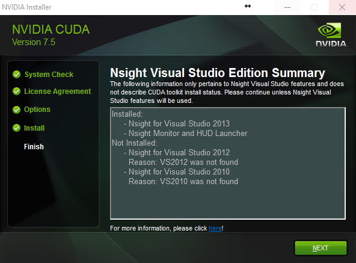

So make sure to install VS 2013, if you haven't already. Then, add `C:\Program Files (x86)\Microsoft Visual Studio 12.0\VC\bin` to your `PATH`, based on where you installed VS 2013.

## CUDA 7.5.18 (64-bit)
Download CUDA 7.5 (64-bit) from the [NVidia website] (https://developer.nvidia.com/cuda-downloads)

Select the proper target platform:


Download the installer:

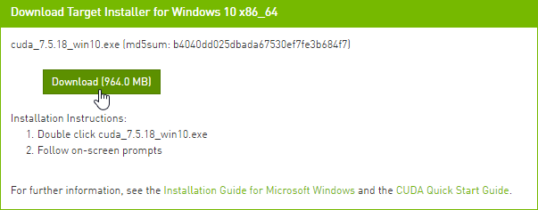

Run the installer. In our case (a fluke?) the installer didn't allow us to choose where to install its files. It installed in `C:\Program Files\NVIDIA GPU Computing Toolkit\CUDA\v7.5`. Once it has done so, move the files from there to `c:\toolkits\cuda-7.5.18` and update `PATH` as follows:

1. Define a system environment (sysenv) variable named `CUDA_HOME` with the value `c:\toolkits\cuda-7.5.18`
2. Add`%CUDA_HOME%\libnwp` and `%CUDA_HOME%\bin` to `PATH`

## MinGW-w64 (5.3.0)

Download MinGW-w64 from [here](https://sourceforge.net/projects/mingw-w64/files/Toolchains%20targetting%20Win32/Personal%20Builds/mingw-builds/):

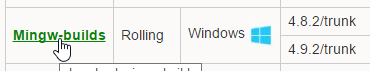

Install it to `c:\toolkits\mingw-w64-5.3.0` with the following settings (second wizard screen):

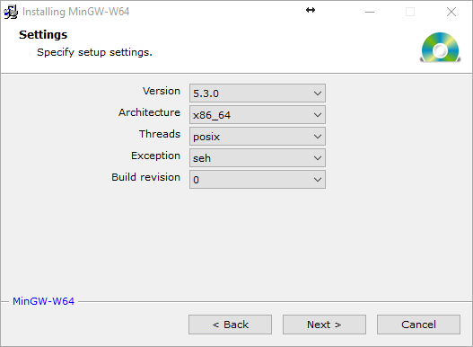

1. Define the sysenv variable `MINGW_HOME` with the value `c:\toolkits\mingw-w64-5.3.0`
2. Add `%MINGW_HOME%\mingw64\bin` to `PATH`

Run the following to make sure all necessary build tools can be found:

```
$ where gcc; where cl; where nvcc; where cudafe; where cudafe++
```

You should get results similar to:

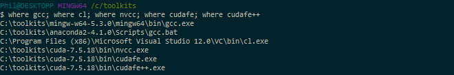

## Anaconda (64-bit) w. Python 2.7 (Anaconda2-4.1.0)

Download Anaconda from [here](https://www.continuum.io/downloads) and install it to `c:\toolkits\anaconda2-4.1.0`:

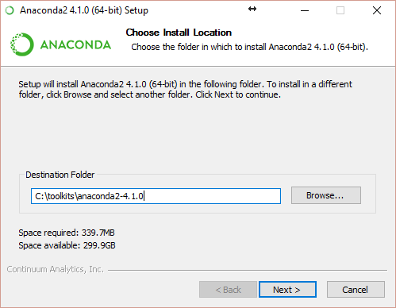

> Warning: Below, we enabled `Register Anaconda as the system Python 2.7` because it works for us, but that may not be the best option for you!

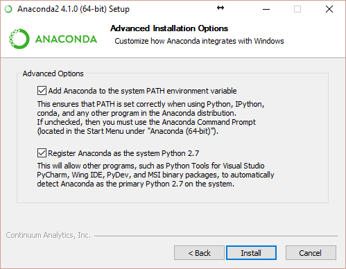


1. Define sysenv variable `PYTHON_HOME` with the value `c:\toolkits\anaconda2-4.1.0`
2. Add `%PYTHON_HOME%`, `%PYTHON_HOME%\Scripts`, and `%PYTHON_HOME%\Library\bin` to `PATH`

After anaconda installation open a MINGW64 command prompt and execute:

```
$ cd $PYTHON_HOME
$ conda install libpython
```

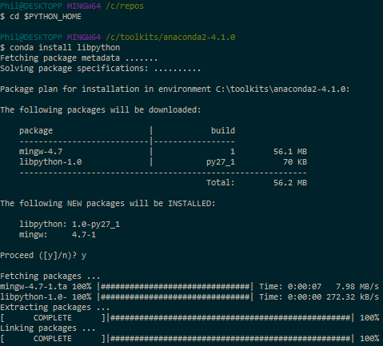

## Theano 0.8.2

Version 0.8.2? Why not just install the latest bleeding-edge version of Theano since it obviously must work better, right? Simply put, because it makes [reproducible research](https://www.coursera.org/learn/reproducible-research) harder. If your work colleagues or Kaggle teammates install the latest code from the dev branch at a different time than you did, you will most likely be running different code bases on your machines, increasing the odds that even though you're using the same input data (the same random seeds, etc.), you still end up with different results when you shouldn't. For this reason alone, we highly recommend only using point releases, the same one across machines, and always documenting which one you use if you can't just use a setup script.

Clone a stable Theano release (0.8.2) to your local machine from GitHub using the following commands:

```
$ cd /c/toolkits
$ git clone https://github.com/Theano/Theano.git theano-0.8.2 --branch rel-0.8.2
```

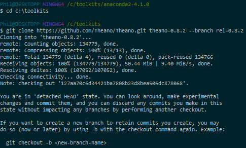

This should clone Theano 0.8.2 in `c:\toolkits\theano-0.8.2`:

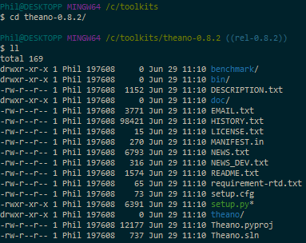

Install it as follows:

```
$ cd /c/toolkits/theano-0.8.2
$ python setup.py install --record installed_files.txt
```

The list of files installed can be found [here](https://dl.dropboxusercontent.com/u/5888080/installed_files.txt)

Verify Theano was installed by querying Anaconda for the list of installed packages:

```
$ conda list | grep -i theano
```

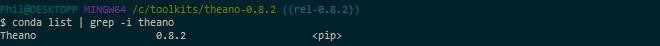

## OpenBLAS 0.2.14 (Optional)

If we're going to use the GPU, why install a CPU-optimized linear algebra library? With our setup, most of the deep learning grunt work is performed by the GPU, that is correct, but *the CPU isn't idle*. An important part of image-based Kaggle competitions is **data augmentation**. In that context, data augmentation is the process of manufacturing additional input samples (more training images) by transformation of the original training samples, via the use of image processing operators. Basic transformations such as downsampling and (mean-centered) normalization are also needed. If you feel adventurous, you'll want to try additional pre-processing enhancements (noise removal, histogram equalization, etc.). You certainly could use the GPU for that purpose and save the results to file. In practice, however, those operations are often executed **in parallel on the CPU** while the GPU is busy learning the weights of the deep neural network and the augmented data discarded after use. For this reason, we *highly recommend* installing the OpenBLAS library.

According to the Theano [documentation](http://deeplearning.net/software/theano_versions/dev/install_windows.html#install-windows), the multi-threaded [OpenBLAS](https://en.wikipedia.org/wiki/OpenBLAS) library performs much better than the un-optimized standard BLAS (Basic Linear Algebra Subprograms) library, so that's what we use.

Download OpenBLAS from [here](https://sourceforge.net/projects/openblas/files/v0.2.14/OpenBLAS-v0.2.14-Win64-int32.zip/download) and extract the files to `c:\toolkits\openblas-0.2.14-int32`

1. Define sysenv variable `OPENBLAS_HOME` with the value `c:\toolkits\openblas-0.2.14-int32`
2. Add `%OPENBLAS_HOME%\bin` to `PATH`

## Switching between CPU and GPU mode

Next, create the two following sysenv variables:

- sysenv variable `THEANO_FLAGS_CPU` with the value:

`floatX=float32,device=cpu,lib.cnmem=0.8,blas.ldflags=-LC:/toolkits/openblas-0.2.14-int32/bin -lopenblas`

- sysenv variable `THEANO_FLAGS_GPU` with the value:

`floatX=float32,device=gpu,dnn.enabled=False,lib.cnmem=0.8,blas.ldflags=-LC:/toolkits/openblas-0.2.14-int32/bin -lopenblas`

Theano only cares about the value of the sysenv variable named `THEANO_FLAGS`. All we need to do to tell Theano to use the CPU or GPU is to set `THEANO_FLAGS` to either `THEANO_FLAGS_CPU` or `THEANO_FLAGS_GPU`. You can verify those variables have been successfully added to your environment with the following command:

```
$ env | grep -i theano
```

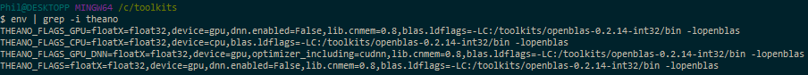

> Note: See the cuDNN section below for information about the `THEANO_FLAGS_GPU_DNN` flag

## Validating our OpenBLAS install (Optional)

We can use the following program from the [Theano documentation](http://deeplearning.net/software/theano/install_windows.html):

```python
import numpy as np
import time
import theano

print('blas.ldflags=', theano.config.blas.ldflags)

A = np.random.rand(1000, 10000).astype(theano.config.floatX)
B = np.random.rand(10000, 1000).astype(theano.config.floatX)
np_start = time.time()
AB = A.dot(B)
np_end = time.time()
X, Y = theano.tensor.matrices('XY')
mf = theano.function([X, Y], X.dot(Y))
t_start = time.time()
tAB = mf(A, B)
t_end = time.time()
print("numpy time: %f[s], theano time: %f[s] (times should be close when run on CPU!)" % (
np_end - np_start, t_end - t_start))
print("Result difference: %f" % (np.abs(AB - tAB).max(), ))
```

Save the code above to a file named `openblas_test.py` in the current directory (or download it from this [GitHub repo](https://github.com/philferriere/dlwin)) and run the next commands:

```
$ THEANO_FLAGS=$THEANO_FLAGS_CPU
$ python openblas_test.py
```

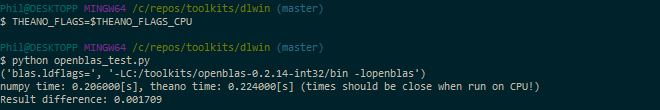

> Note: If you get a failure of the kind `NameError: global name 'CVM' is not defined`, it may be because, like us, you've messed with the value of `THEANO_FLAGS_CPU` and switched back and forth between `floatX=float32` and `floatX=float64` several times. Cleaning your `C:\Users\username\AppData\Local\Theano` directory (replace username with your login name) will fix the problem (See [here](https://groups.google.com/forum/#!msg/theano-users/JoTu61_MTLk/4ZzsVyaOf2kJ), for reference)

## Validating our GPU install with Theano

We'll run the following program from the Theano documentation to compare the performance of the GPU install vs using Theano in CPU-mode. Save the code to a file named `cpu_gpu_test.py` in the current directory (or download it from this [GitHub repo](https://github.com/philferriere/dlwin)):

```python
from theano import function, config, shared, sandbox
import theano.tensor as T
import numpy
import time

vlen = 10 * 30 * 768  # 10 x #cores x # threads per core
iters = 1000

rng = numpy.random.RandomState(22)
x = shared(numpy.asarray(rng.rand(vlen), config.floatX))
f = function([], T.exp(x))
print(f.maker.fgraph.toposort())
t0 = time.time()
for i in range(iters):
    r = f()
t1 = time.time()
print("Looping %d times took %f seconds" % (iters, t1 - t0))
print("Result is %s" % (r,))
if numpy.any([isinstance(x.op, T.Elemwise) for x in f.maker.fgraph.toposort()]):
    print('Used the cpu')
else:
    print('Used the gpu')
```

First, let's see what kind of results we get running Theano in CPU mode:

```
$ THEANO_FLAGS=$THEANO_FLAGS_CPU
$ python cpu_gpu_test.py
```

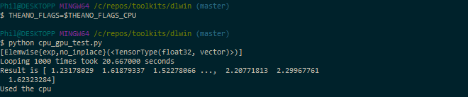

Next, let's run the same program on the GPU:

```
$ THEANO_FLAGS=$THEANO_FLAGS_GPU
$ python cpu_gpu_test.py
```

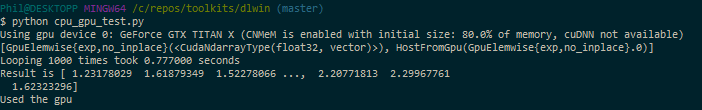

Almost **a 26:1 improvement**. It works! Great, we're done with setting up Theano 0.8.2.

## Keras 1.0.5

Clone a stable Keras release (1.0.5) to your local machine from GitHub using the following commands:

```
$ cd /c/toolkits
$ git clone https://github.com/fchollet/keras.git keras-1.0.5 --branch 1.0.5
```

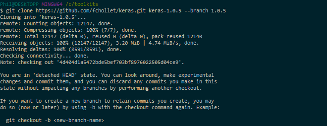

This should clone Keras 1.0.5 in `c:\toolkits\keras-1.0.5`:

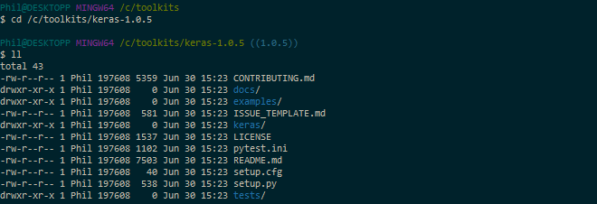

Install it as follows:

```
$ cd /c/toolkits/keras-1.0.5
$ python setup.py install --record installed_files.txt
```

The list of files installed can be found [here](https://dl.dropboxusercontent.com/u/5888080/installed_files2.txt)

Verify Keras was installed by querying Anaconda for the list of installed packages:

```
$ conda list | grep -i keras
```

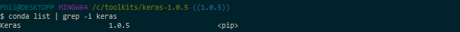

## Validating our GPU install with Keras

We can train a simple convnet ([convolutional neural network](https://en.wikipedia.org/wiki/Convolutional_neural_network)) on the [MNIST dataset](https://en.wikipedia.org/wiki/MNIST_database#Dataset) by using one of the example scripts provided with Keras. The file is called `mnist_cnn.py` and can be found in the `examples` folder:

```
$ cd /c/toolkits/keras-1.0.5/examples
$ python mnist_cnn.py
```

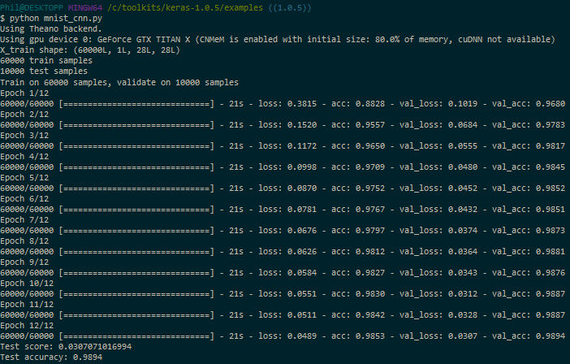

Without cuDNN, each epoch takes about 21s. If you install [TechPowerUp's GPU-Z](https://www.techpowerup.com/downloads/2718/techpowerup-gpu-z-v0-8-9/mirrors), you can track how well the GPU is being leveraged. Here, in the case of this convnet (no cuDNN), we max out at 76% GPU usage on average:

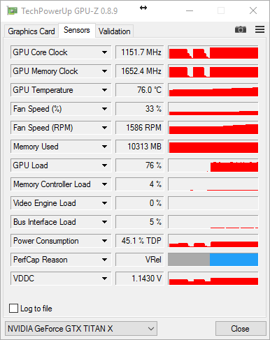

## cuDNN v5 (Conditional)

If you're not going to train convnets then you might not really benefit from installing cuDNN. Per NVidia's [website](https://developer.nvidia.com/cudnn), "cuDNN provides highly tuned implementations for standard routines such as forward and backward convolution, pooling, normalization, and activation layers," hallmarks of convolution network architectures. Theano is mentioned in the list of [frameworks that support cuDNN v5](https://developer.nvidia.com/deep-learning-frameworks) for GPU acceleration.

If you are going to train convnets, then download cuDNN from [here](https://developer.nvidia.com/rdp/cudnn-download). Choose the cuDNN Library for Windows10 dated May 12, 2016:

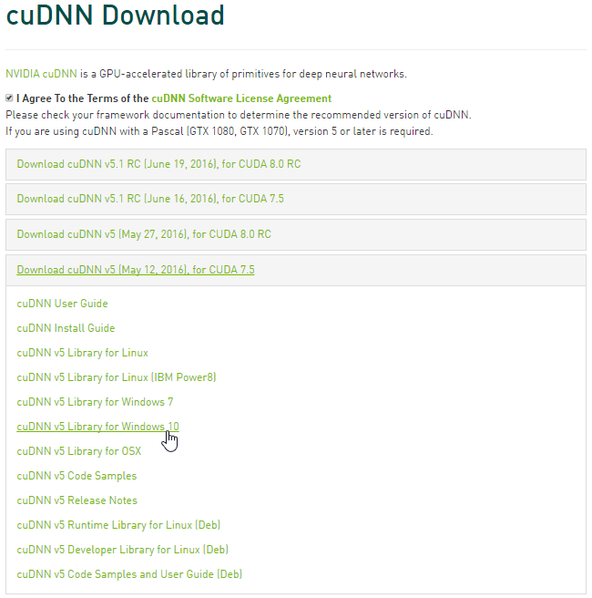

The downloaded ZIP file contains three directories (`bin`, `include`, `lib`). Extract those directories and copy the files they contain to the identically named folders in `C:\toolkits\cuda-7.5.18`.

To enable cuDNN, create a new sysenv variable named `THEANO_FLAGS_GPU_DNN` with the following value:

`floatX=float32,device=gpu,optimizer_including=cudnn,lib.cnmem=0.8,dnn.conv.algo_bwd_filter=deterministic,dnn.conv.algo_bwd_data=deterministic,blas.ldflags=-LC:/toolkits/openblas-0.2.14-int32/bin -lopenblas`

Then, run the following commands:

```
$ THEANO_FLAGS=$THEANO_FLAGS_GPU_DNN
$ cd /c/toolkits/keras-1.0.5/examples
$ python mnist_cnn.py
```

> Note: If you get a `cuDNN not available` message after this, try cleaning your `C:\Users\username\AppData\Local\Theano` directory (replace username with your login name).

Here's the (cleaned up) execution log for the simple convnet Keras example, using cuDNN:

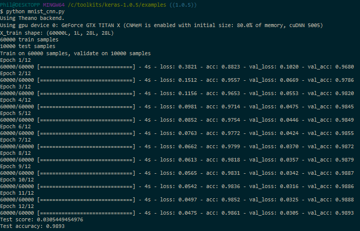

Now, each epoch takes about 4s, instead of 21s, **a huge improvement in speed**, with roughly the same GPU usage:

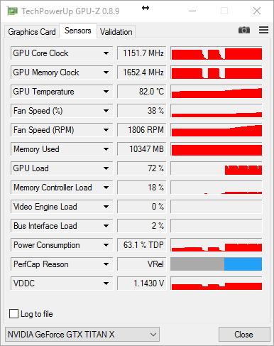

We're done!

# References

[Setup a Deep Learning Environment on Windows (Theano & Keras with GPU Enabled)](https://datanoord.com/2016/02/02/setup-a-deep-learning-environment-on-windows-theano-keras-with-gpu-enabled/), by Ayse Elvan Aydemir

[Installation of Theano on Windows](http://deeplearning.net/software/theano_versions/dev/install_windows.html#install-windows), by Theano team

[A few tips to install theano on Windows, 64 bits](https://www.kaggle.com/c/otto-group-product-classification-challenge/forums/t/13973/a-few-tips-to-install-theano-on-windows-64-bits), by Kagglers

[How do I install Keras and Theano in Anaconda Python 2.7 on Windows?](http://stackoverflow.com/questions/34097988/how-do-i-install-keras-and-theano-in-anaconda-python-2-7-on-windows), by S.O. contributors

# Additional Thanks Go To...

[Kaggler Vincent L.](https://www.kaggle.com/vincentl) for recommending adding `dnn.conv.algo_bwd_filter=deterministic,dnn.conv.algo_bwd_data=deterministic` to THEANO_FLAGS_GPU_DNN in order to improve reproducibility with no observable impact on performance.

If you'd rather use Python3, conda's built-in MinGW package, or pip, please refer to [@stmax82](https://github.com/stmax82)'s note [here](https://github.com/philferriere/dlwin/issues/1).

# Suggested viewing/reading

Intro to Deep Learning with Python, by Alec Radford

@ https://www.youtube.com/watch?v=S75EdAcXHKk

@ http://slidesha.re/1zs9M11

@ https://github.com/Newmu/Theano-Tutorials

# About the Author

For information about the author, please visit:

[](https://www.linkedin.com/in/philferriere)


