GPU-accelerated Tensorflow or Theano & Keras on Windows 10 native
===================================================

**>> LAST UPDATED MAY, 2017 <<**

There are certainly a lot of guides to assist you build great deep learning (DL) setups on Linux or Mac OS (including with Tensorflow which, unfortunately, as of this posting, cannot be easily installed on Windows), but few care about building an efficient Windows 10-**native** setup. Most focus on running an Ubuntu VM hosted on Windows or using Docker, unnecessary - and ultimately sub-optimal - steps.

We also found enough misguiding/deprecated information out there to make it worthwhile putting together a step-by-step guide for the latest stable versions of Theano and Keras. Used together, they make for one of the simplest and fastest DL configurations to work natively on Windows.

If you **must** run your DL setup on Windows 10, then the information contained here may be useful to you.

# Dependencies
Here's a summary list of the tools and libraries we use for deep learning on Windows 10 (Version 1607 OS Build 14393.222):

1. Visual Studio 2015 Community Edition Update 3 w. Windows Kit 10.0.10240.0
   - Used for its C/C++ compiler (not its IDE) and SDK
2. Anaconda (64-bit) w. Python 2.7 (Anaconda2-4.2.0) or Python 3.5 (Anaconda3-4.2.0)
   - A Python distro that gives us NumPy, SciPy, and other scientific libraries
3. CUDA 8.0.61 (64-bit)
   - Used for its GPU math libraries, card driver, and CUDA compiler
4. MinGW-w64 (5.4.0)
   - Used for its Unix-like compiler and build tools (g++/gcc, make...) for Windows
5. Theano 0.9
   - Used to evaluate mathematical expressions on multi-dimensional arrays
6. Keras 2.0.4
   - Used for deep learning on top of Theano
7. OpenBLAS 0.2.19 (Optional)
   - Used for its CPU-optimized implementation of many linear algebra operations
8. cuDNN v5.1 (August 10, 2016) for CUDA 8.0 (Conditional)
   - Used to run vastly faster convolution neural networks
9. Tensorflow 1.1.0
   - Used to evaluate mathematical expressions on multi-dimensional arrays and serves as an alternative backend to Theano

# Hardware

1. Dell Precision T7900, 64GB RAM
   - Intel Xeon E5-2630 v4 @ 2.20 GHz (1 processor, 10 cores total, 20 logical processors)
2. NVIDIA GeForce Titan X, 12GB RAM
   - Driver version: 372.90 / Win 10 64

# Installation steps

We like to keep our toolkits and libraries in a single root folder boringly called `c:\toolkits`, so whenever you see a Windows path that starts with `c:\toolkits` below, make sure to replace it with whatever you decide your own toolkit drive and folder ought to be.

## Visual Studio 2015 Community Edition Update 3 w. Windows Kit 10.0.10240.0

You can download Visual Studio 2015 Community Edition from [here](https://www.microsoft.com/en-us/download/details.aspx?id=48146):

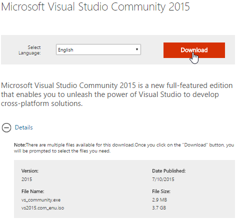

Select the executable and let it decide what to download on its own:

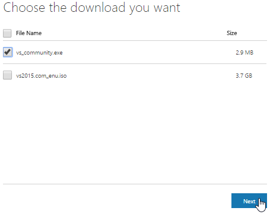

Run the downloaded executable to install Visual Studio, using whatever additional config settings work best for you:

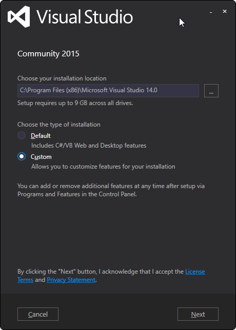

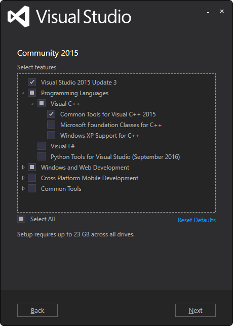


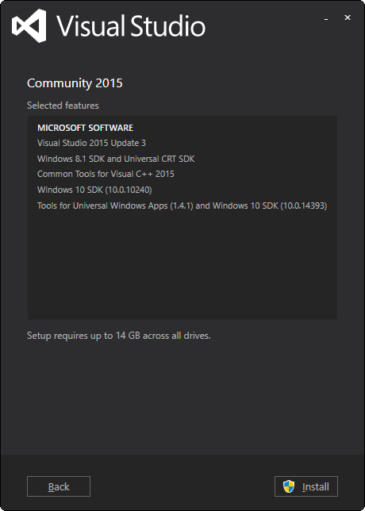

1. Add `C:\Program Files (x86)\Microsoft Visual Studio 14.0\VC\bin` to your `PATH`, based on where you installed VS 2015.
2. Define sysenv variable `INCLUDE` with the value `C:\Program Files (x86)\Windows Kits\10\Include\10.0.10240.0\ucrt`
3. Define sysenv variable `LIB` with the value `C:\Program Files (x86)\Windows Kits\10\Lib\10.0.10240.0\um\x64;C:\Program Files (x86)\Windows Kits\10\Lib\10.0.10240.0\ucrt\x64`

> Reference Note: We couldn't run any Theano python files until we added the last two env variables above. We would get a `c:\program files (x86)\microsoft visual studio 14.0\vc\include\crtdefs.h(10): fatal error C1083: Cannot open include file: 'corecrt.h': No such file or directory` error at compile time and missing `kernel32.lib uuid.lib ucrt.lib` errors at link time. True, you could probably run `C:\Program Files (x86)\Microsoft Visual Studio 14.0\VC\bin\amd64\vcvars64.bat` (with proper params) every single time you open a MINGW cmd prompt, but, obviously, none of the sysenv vars would stick from one session to the next.

## Anaconda (64-bit)

This tutorial was initially created with Python 2.7, but Python 3.5 works too. The newest Anaconda version uses Python 3.6, but that version is still [poorly supported](https://github.com/tensorflow/tensorflow/issues/6999). 
> Depending on your installation use `c:\toolkits\anaconda3-4.2.0` instead of `c:\toolkits\anaconda2-4.2.0`.

Download the appropriate Anaconda version from [here](https://www.continuum.io/downloads), 
note that you have to browse the Anaconda installer archive for [Anaconda3-4.2.0](https://repo.continuum.io/archive/Anaconda3-4.2.0-Windows-x86_64.exe):

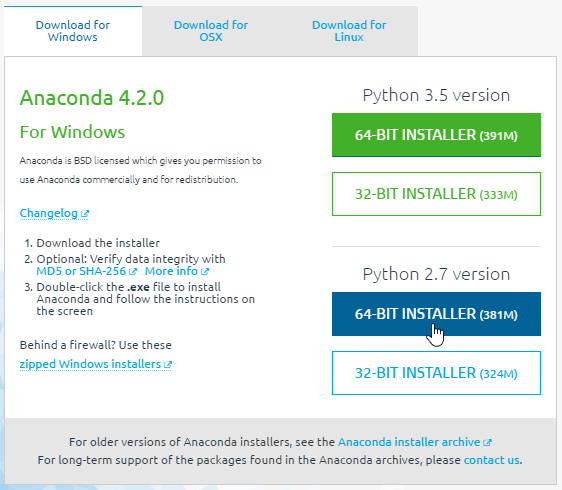

Run the downloaded executable to install Anaconda in `c:\toolkits\anaconda2-4.2.0`:

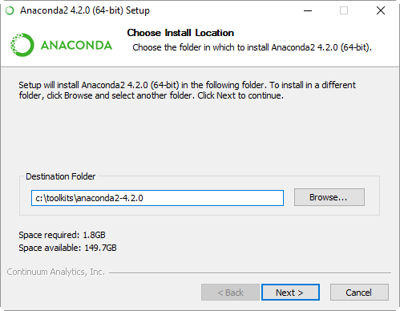

> Warning: Below, we enabled `Register Anaconda as the system Python 2.7` because it works for us, but that may not be the best option for you!

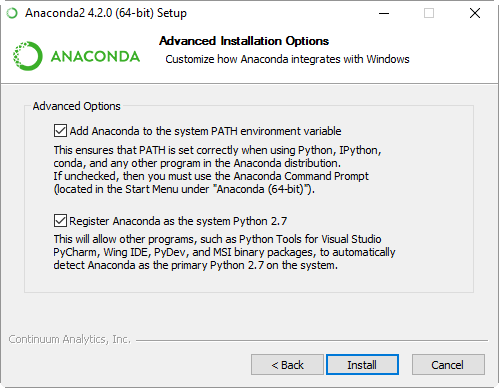

The installation should create the environment variables automatically if you chose to.
Otherwise make sure that the following variables are defined:

1. Define sysenv variable `PYTHON_HOME` with the value `c:\toolkits\anaconda2-4.2.0`
2. Add `%PYTHON_HOME%`, `%PYTHON_HOME%\Scripts`, and `%PYTHON_HOME%\Library\bin` to `PATH`

After anaconda installation open a command prompt and execute:

```
$ cd $PYTHON_HOME; conda install libpython
```

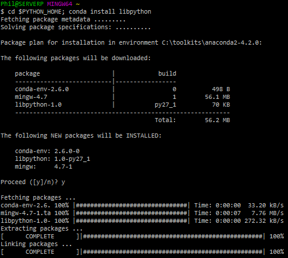

> Note: The version of MinGW above is old (gcc 4.7.0). Instead, we will use MinGW 5.4.0, as shown below.

## CUDA 8.0.61 (64-bit)
Download CUDA 8.0 (64-bit) from the [NVidia website] (https://developer.nvidia.com/cuda-downloads)

Select the proper target platform:

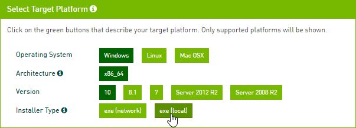

Download the installer:

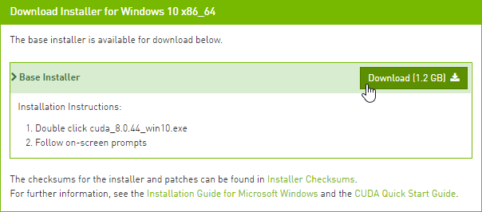

Run the downloaded installer. Install the files in `c:\toolkits\cuda-8.0.61`:

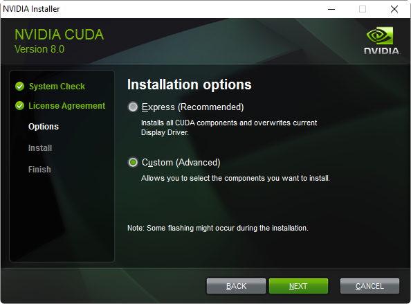

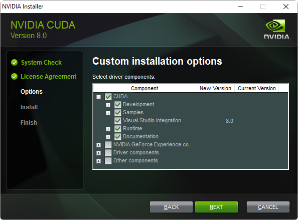

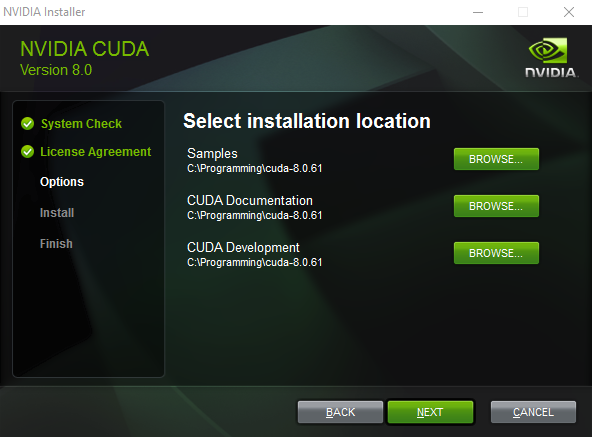

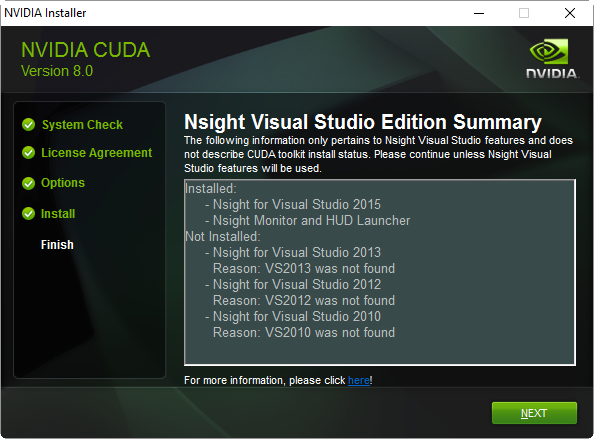

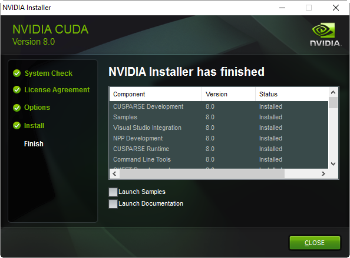

After completion, the installer should have created a system environment (sysenv) variable named `CUDA_PATH` and added `%CUDA_PATH%\bin` as well as`%CUDA_PATH%\libnvvp` to `PATH`. Check that it is indeed the case. If, for some reason, the CUDA env vars are missing, then:

1. Define a system environment (sysenv) variable named `CUDA_PATH` with the value `c:\toolkits\cuda-8.0.61`
2. Add`%CUDA_PATH%\libnvvp` and `%CUDA_PATH%\bin` to `PATH`

## MinGW-w64 (5.4.0)

Download MinGW-w64 from [here](https://sourceforge.net/projects/mingw-w64/files/Toolchains%20targetting%20Win32/Personal%20Builds/mingw-builds/installer/)
note that newer version of the G++ compiler are not supported by Theano:

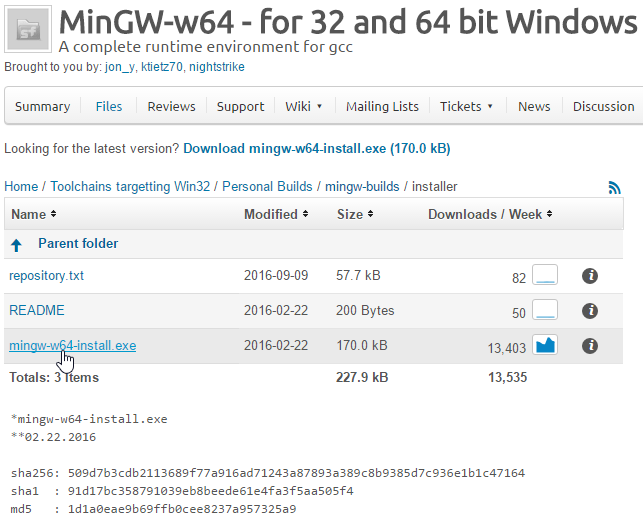

Install it to `c:\toolkits\mingw-w64-5.4.0` with the following settings (second wizard screen):

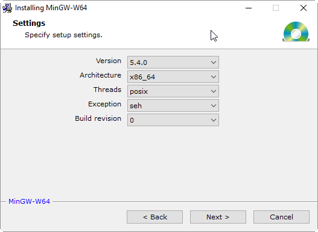

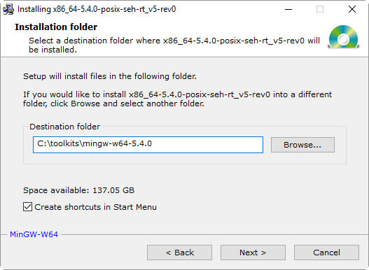


1. Define the sysenv variable `MINGW_HOME` with the value `c:\toolkits\mingw-w64-5.4.0`
2. Add `%MINGW_HOME%\mingw64\bin` to `PATH`

Run the following to make sure all necessary build tools can be found:

```
$ where gcc; where g++; where cl; where nvcc; where cudafe; where cudafe++
$ gcc --version; g++ --version
$ cl
$ nvcc --version; cudafe --version; cudafe++ --version
```

You should get results similar to:

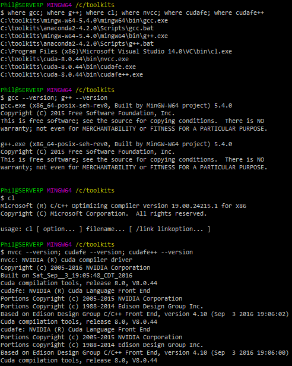

## Keras 2.0.4 and Theano 0.9

Why those specific versions? Why not just install the latest bleeding-edge version of 
Keras and Theano since they obviously must work better, right? Simply put, because it 
makes [reproducible research](https://www.coursera.org/learn/reproducible-research) harder. 
If your work colleagues or Kaggle teammates install the latest code from the dev branch at a 
different time than you did, you will most likely be running different code bases on your machines, 
increasing the odds that even though you're using the same input data (the same random seeds, etc.), 
you still end up with different results when you shouldn't. 
For this reason alone, we highly recommend only using point releases, the same one across machines, 
and always documenting which one you use if you can't just use a setup script.

```
$ pip install keras==2.0.4
```

This will install Keras and Theano inside of your Python distribution 

### Get the source for Keras

If you wish, you may also clone the Keras repository from github to get the sample sources used in this tutorial

```
$ cd /c/toolkits
$ git clone https://github.com/fchollet/keras.git keras-2.0.4 --branch 2.0.4
```

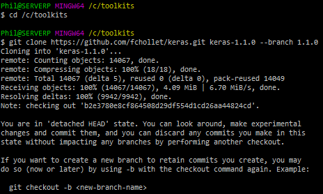

This should clone Keras 2.0.4 in `c:\toolkits\keras-2.0.4`:

Verify Keras was installed by querying Anaconda for the list of installed packages:

```
$ conda list | grep -i keras
```

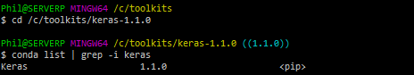


## OpenBLAS 0.2.19 (Optional)

> Note that the [documentation](http://deeplearning.net/software/theano_versions/dev/install_windows.html#install-windows) was updated an now recommends MKL-Service, so all OpenBLAS steps might be skipped.

If we're going to use the GPU, why install a CPU-optimized linear algebra library? With our setup, most of the deep learning grunt work is performed by the GPU, that is correct, but *the CPU isn't idle*. An important part of image-based Kaggle competitions is **data augmentation**. In that context, data augmentation is the process of manufacturing additional input samples (more training images) by transformation of the original training samples, via the use of image processing operators. Basic transformations such as downsampling and (mean-centered) normalization are also needed. If you feel adventurous, you'll want to try additional pre-processing enhancements (noise removal, histogram equalization, etc.). You certainly could use the GPU for that purpose and save the results to file. In practice, however, those operations are often executed **in parallel on the CPU** while the GPU is busy learning the weights of the deep neural network and the augmented data discarded after use. For this reason, we *highly recommend* installing the OpenBLAS library.

According to the Theano [documentation](http://deeplearning.net/software/theano_versions/dev/install_windows.html#install-windows), the multi-threaded [OpenBLAS](https://en.wikipedia.org/wiki/OpenBLAS) library performs much better than the un-optimized standard BLAS (Basic Linear Algebra Subprograms) library, so that's what we use.

Download OpenBLAS from [here](https://sourceforge.net/projects/openblas/files/v0.2.19/OpenBLAS-v0.2.19-Win64-int32.zip/download) and extract the files to `c:\toolkits\openblas-0.2.19`

1. Define sysenv variable `OPENBLAS_HOME` with the value `c:\toolkits\openblas-0.2.19`
2. Add `%OPENBLAS_HOME%\bin` to `PATH`

### MKL-Service

Install the MKL-Service library which provides an alternative to OpenBLAS via conda

`$ conda install mkl-service`


## Switching between CPU and GPU mode

Next, create the two following sysenv variables:

- sysenv variable `THEANO_FLAGS_CPU` with the value:

`floatX=float32,device=cpu,lib.cnmem=0.8,blas.ldflags=-LC:/toolkits/openblas-0.2.19/bin -lopenblas`

- sysenv variable `THEANO_FLAGS_GPU` with the value:

`floatX=float32,device=gpu,dnn.enabled=False,lib.cnmem=0.8,blas.ldflags=-LC:/toolkits/openblas-0.2.19/bin -lopenblas`

Theano only cares about the value of the sysenv variable named `THEANO_FLAGS`. All we need to do to tell Theano to use the CPU or GPU is to set `THEANO_FLAGS` to either `THEANO_FLAGS_CPU` or `THEANO_FLAGS_GPU`. You can verify those variables have been successfully added to your environment with the following command:

```
$ env | grep -i theano
```

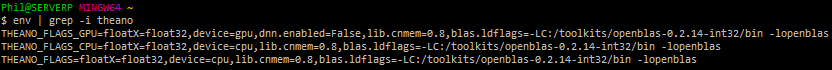


## Validating our OpenBLAS install (Optional)

We can use the following program from the [Theano documentation](http://deeplearning.net/software/theano/install_windows.html):

```python
import numpy as np
import time
import theano

print('blas.ldflags=', theano.config.blas.ldflags)

A = np.random.rand(1000, 10000).astype(theano.config.floatX)
B = np.random.rand(10000, 1000).astype(theano.config.floatX)
np_start = time.time()
AB = A.dot(B)
np_end = time.time()
X, Y = theano.tensor.matrices('XY')
mf = theano.function([X, Y], X.dot(Y))
t_start = time.time()
tAB = mf(A, B)
t_end = time.time()
print("numpy time: %f[s], theano time: %f[s] (times should be close when run on CPU!)" % (
np_end - np_start, t_end - t_start))
print("Result difference: %f" % (np.abs(AB - tAB).max(), ))
```

Save the code above to a file named `openblas_test.py` in the current directory (or download it from this [GitHub repo](https://github.com/philferriere/dlwin)) and run the next commands:

```
$ THEANO_FLAGS=$THEANO_FLAGS_CPU
$ python openblas_test.py
```

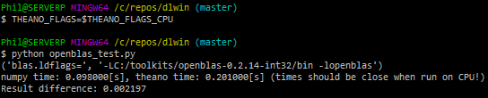

> Note: If you get a failure of the kind `NameError: global name 'CVM' is not defined`, it may be because, like us, you've messed with the value of `THEANO_FLAGS_CPU` and switched back and forth between `floatX=float32` and `floatX=float64` several times. Cleaning your `C:\Users\username\AppData\Local\Theano` directory (replace username with your login name) will fix the problem (See [here](https://groups.google.com/forum/#!msg/theano-users/JoTu61_MTLk/4ZzsVyaOf2kJ), for reference)

## Checking our PATH sysenv var

At this point, the `PATH` environment variable should look something like:

```
%MINGW_HOME%\mingw64\bin;
%CUDA_PATH%\bin;
%CUDA_PATH%\libnvvp;
%OPENBLAS_HOME%\bin;
%PYTHON_HOME%;
%PYTHON_HOME%\Scripts;
%PYTHON_HOME%\Library\bin;
C:\ProgramData\Oracle\Java\javapath;
C:\WINDOWS\system32;
C:\WINDOWS;
C:\WINDOWS\System32\Wbem;
C:\WINDOWS\System32\WindowsPowerShell\v1.0\;
C:\Program Files (x86)\NVIDIA Corporation\PhysX\Common;
C:\Program Files (x86)\Microsoft Visual Studio 14.0\VC\bin;
C:\Program Files (x86)\Windows Kits\10\Windows Performance Toolkit\;
C:\Program Files\Git\cmd;
C:\Program Files\Git\mingw64\bin;
C:\Program Files\Git\usr\bin
...
```

## Validating our GPU install with Theano

We'll run the following program from the Theano documentation to compare the performance of the GPU install vs using Theano in CPU-mode. Save the code to a file named `cpu_gpu_test.py` in the current directory (or download it from this [GitHub repo](https://github.com/philferriere/dlwin)):

```python
from theano import function, config, shared, sandbox
import theano.tensor as T
import numpy
import time

vlen = 10 * 30 * 768  # 10 x #cores x # threads per core
iters = 1000

rng = numpy.random.RandomState(22)
x = shared(numpy.asarray(rng.rand(vlen), config.floatX))
f = function([], T.exp(x))
print(f.maker.fgraph.toposort())
t0 = time.time()
for i in range(iters):
    r = f()
t1 = time.time()
print("Looping %d times took %f seconds" % (iters, t1 - t0))
print("Result is %s" % (r,))
if numpy.any([isinstance(x.op, T.Elemwise) for x in f.maker.fgraph.toposort()]):
    print('Used the cpu')
else:
    print('Used the gpu')
```

First, let's see what kind of results we get running Theano in CPU mode:

```
$ THEANO_FLAGS=$THEANO_FLAGS_CPU
$ python cpu_gpu_test.py
```

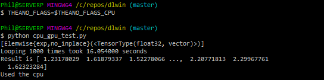

Next, let's run the same program on the GPU:

```
$ THEANO_FLAGS=$THEANO_FLAGS_GPU
$ python cpu_gpu_test.py
```

> Note: If you get a `c:\program files (x86)\microsoft visual studio 14.0\vc\include\crtdefs.h(10): fatal error C1083: Cannot open include file: 'corecrt.h': No such file or directory` with the above, please see the Reference Note at the end of the `Visual Studio 2015 Community Edition Update 3` section.

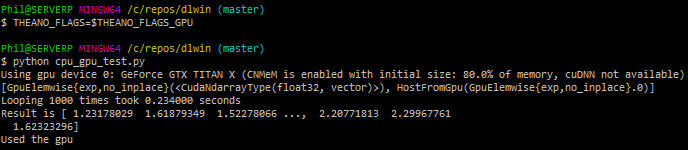

Almost **a 68:1 improvement**. It works! Great, we're done with setting up Theano 0.8.2.

## Validating our GPU install with Keras

We can train a simple convnet ([convolutional neural network](https://en.wikipedia.org/wiki/Convolutional_neural_network)) on the [MNIST dataset](https://en.wikipedia.org/wiki/MNIST_database#Dataset) by using one of the example scripts provided with Keras. The file is called `mnist_cnn.py` and can be found in the `examples` folder:

```
$ THEANO_FLAGS=$THEANO_FLAGS_GPU
$ cd /c/toolkits/keras-2.0.4/examples
$ python mnist_cnn.py
```

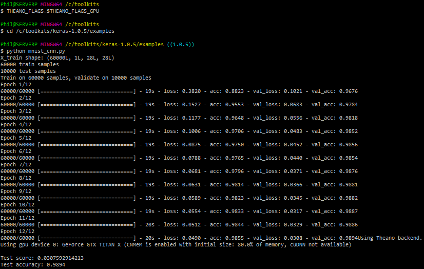

Without cuDNN, each epoch takes about 20s. If you install [TechPowerUp's GPU-Z](https://www.techpowerup.com/downloads/SysInfo/GPU-Z/), you can track how well the GPU is being leveraged. Here, in the case of this convnet (no cuDNN), we max out at 92% GPU usage on average:

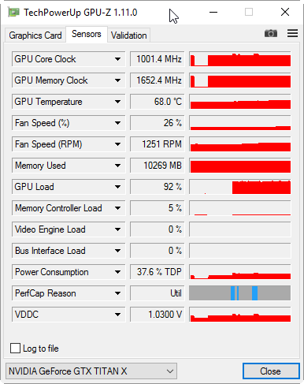

## cuDNN v5.1 (August 10, 2016) for CUDA 8.0 (Conditional)

If you're not going to train convnets then you might not really benefit from installing cuDNN. Per NVidia's [website](https://developer.nvidia.com/cudnn), "cuDNN provides highly tuned implementations for standard routines such as forward and backward convolution, pooling, normalization, and activation layers," hallmarks of convolution network architectures. Theano is mentioned in the list of [frameworks that support cuDNN v5](https://developer.nvidia.com/deep-learning-frameworks) for GPU acceleration.

If you are going to train convnets, then download cuDNN from [here](https://developer.nvidia.com/rdp/cudnn-download). Choose the cuDNN Library for Windows10 dated August 10, 2016:

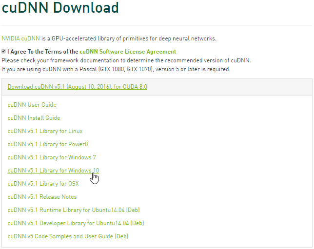

The downloaded ZIP file contains three directories (`bin`, `include`, `lib`). Extract those directories and copy the files they contain to the identically named folders in `C:\toolkits\cuda-8.0.61`.

To enable cuDNN, create a new sysenv variable named `THEANO_FLAGS_GPU_DNN` with the following value:

`floatX=float32,device=gpu,optimizer_including=cudnn,lib.cnmem=0.8,dnn.conv.algo_bwd_filter=deterministic,dnn.conv.algo_bwd_data=deterministic,blas.ldflags=-LC:/toolkits/openblas-0.2.19/bin -lopenblas`

Then, run the following commands:

```
$ THEANO_FLAGS=$THEANO_FLAGS_GPU_DNN
$ cd /c/toolkits/keras-2.0.4/examples
$ python mnist_cnn.py
```

> Note: If you get a `cuDNN not available` message after this, try cleaning your `C:\Users\username\AppData\Local\Theano` directory (replace username with your login name). If you get an error similar to `cudnn error: Mixed dnn version. The header is from one version, but we link with a different version (5010, 5005)`, try cuDNN v5.0 instead of cuDNN v5.1. Windows will sometimes also helpfully block foreign `.dll` files from running on your computer. If that is the case, right click and unblock the files to allow them to be used.

Here's the (cleaned up) execution log for the simple convnet Keras example, using cuDNN:

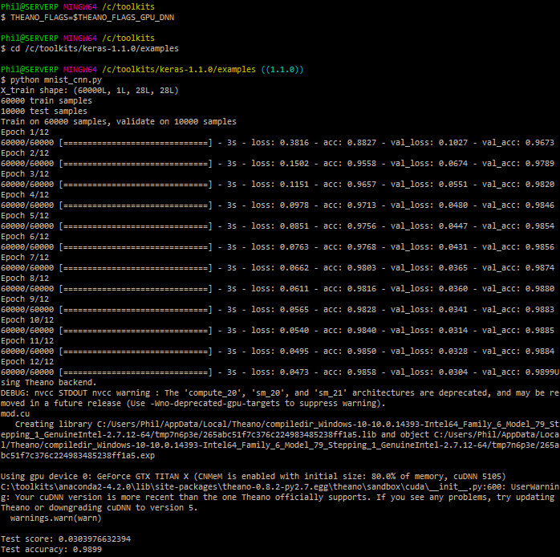

Now, each epoch takes about 3s, instead of 20s, **a large improvement in speed**, with slightly lower GPU usage:

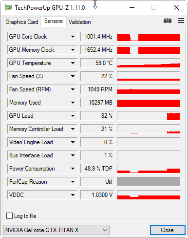

The `Your cuDNN version is more recent than the one Theano officially supports` message certainly sounds ominous but a test accuracy of 0.9899 would suggest that it can be safely ignored. 

## Installing Tensorflow and switching backend

Tensorflow finally supports windows and if so far everything worked out fine for you, you may try to switch to Tensorflow and see if it performs as well. Run the following command to install the GPU-optimized version of tensorflow.

`$ pip install tensorflow-gpu==1.1.0`

> Note that if you had the library `tensorflow` installed previously, you have to uninstall it using `pip uninstall tensorflow`

Ideally this should install tensorflow and now we can switch the backend by editing keras.json in our user-directory.

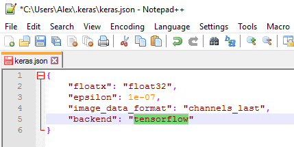

When running the MNIST-dataset example again, we should get similar or potentially even better results:

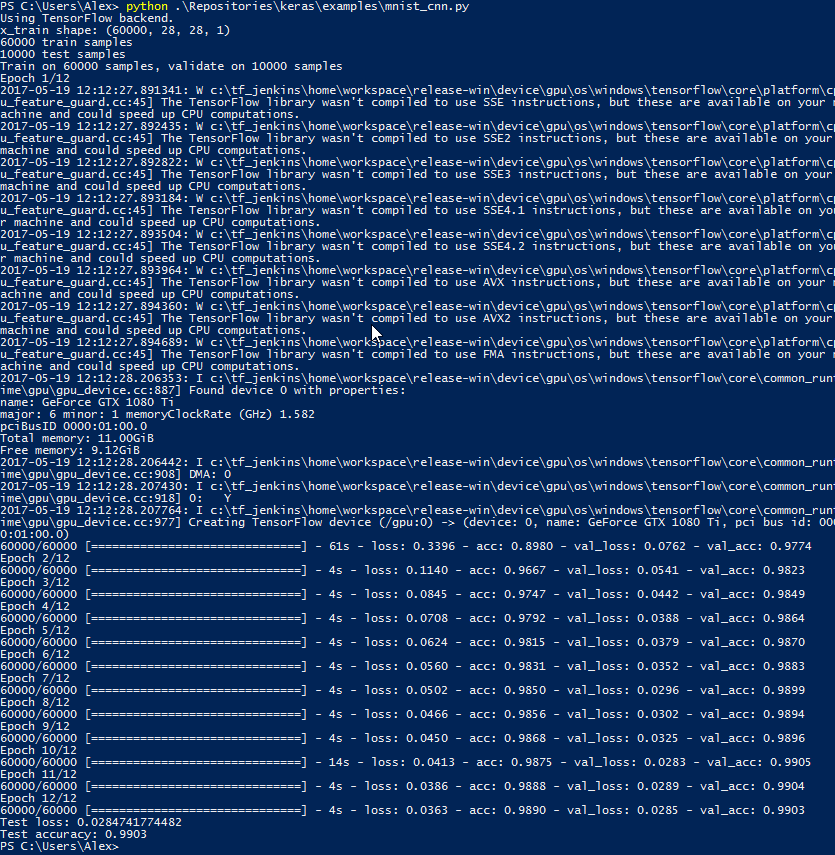

The warnings at the beginning are annoying, but so far there is [no supported way](https://www.tensorflow.org/install/install_sources) of building Tensorflow on Windows with those optimizations, so we have to stay put.

# References

[Setup a Deep Learning Environment on Windows (Theano & Keras with GPU Enabled)](https://datanoord.com/2016/02/02/setup-a-deep-learning-environment-on-windows-theano-keras-with-gpu-enabled/), by Ayse Elvan Aydemir

[Installation of Theano on Windows](http://deeplearning.net/software/theano_versions/dev/install_windows.html#install-windows), by Theano team

[A few tips to install theano on Windows, 64 bits](https://www.kaggle.com/c/otto-group-product-classification-challenge/forums/t/13973/a-few-tips-to-install-theano-on-windows-64-bits), by Kagglers

[How do I install Keras and Theano in Anaconda Python 2.7 on Windows?](http://stackoverflow.com/questions/34097988/how-do-i-install-keras-and-theano-in-anaconda-python-2-7-on-windows), by S.O. contributors

# Additional Thanks Go To...

[Alexander Pacha](https://github.com/apacha) for updating this tutorial several times and extending it to include Tensorflow.

[Kaggler Vincent L.](https://www.kaggle.com/vincentl) for recommending adding `dnn.conv.algo_bwd_filter=deterministic,dnn.conv.algo_bwd_data=deterministic` to THEANO_FLAGS_GPU_DNN in order to improve reproducibility with no observable impact on performance.

If you'd rather use Python3, conda's built-in MinGW package, or pip, please refer to [@stmax82](https://github.com/stmax82)'s note [here](https://github.com/philferriere/dlwin/issues/1).

# Suggested viewing/reading

Intro to Deep Learning with Python, by Alec Radford

@ https://www.youtube.com/watch?v=S75EdAcXHKk

@ http://slidesha.re/1zs9M11

@ https://github.com/Newmu/Theano-Tutorials

# About the Author

For information about the author, please visit:

[](https://www.linkedin.com/in/philferriere)


